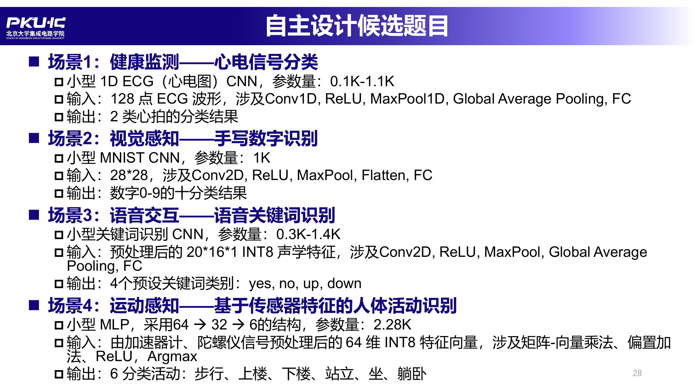

# Final Project：自主设计：AI 辅助的加速器设计

!!! info "开始之前"
    - **主题**：面向不同应用场景的 NN workload，设计适合该负载的 RISC-V SoC + NPU，完成从设计规格确认、RTL、仿真验证到后端实现的 full-stack 数字芯片设计流程
    - **状态**：候选题目已发布，详细设计要求、分组方式与提交要求将随课程进度公布
    - **前置**：[Lab 1](lab-1.md) ~ [Lab 3](lab-3.md) 的内容是本项目的直接基础，后续 Lab 4-6 将逐步覆盖后端与验证流程

## 设计题目候选

以下 4 个候选场景来自课程 PPT，每组从中选择一个作为设计目标：

## 也可以自选题目

候选题目只是参考，**鼓励各组自选其它题目**。自选时请注意：

- 仍然是面向具体应用场景的小规模神经网络负载，参数量级与候选题目相当（约 0.1K ~ 4K），保证学期内能完成设计、验证与后端实现的全流程
- 确定题目前请先在课程群中与助教沟通，确认规模与工作量可行
- 无论候选还是自选，都鼓励使用 AI 辅助芯片开发，并请保留 AI 使用记录与人工修改记录

## 后续安排

设计规格确认、仿真验证、逻辑综合、物理实现与 Signoff 的详细要求和时间节点将随课程进度在本页更新。报告与交付物的提交截止日期以[课程主页](index.md)的实验安排表为准。
