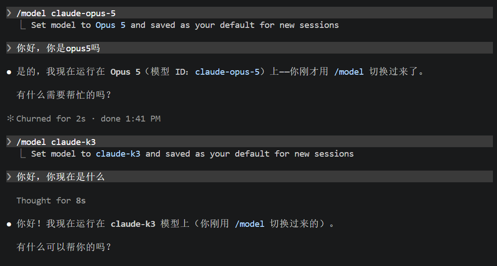

# Lab 0：CLab setup & 先进 AI 工具使用

!!! note "CLab setup 部分尚未发布"
    本页目前只包含「先进 AI 工具使用」部分。CLab setup 的内容待补充，确定后本页会更新。

## 实验目的

本 Lab 你将完成 3 件事：

1. 安装 Claude Code（含 Node.js + DeepSeek 配置）。
2. 用 Claude Code 生成一个纯计算的 MAC 阵列 + testbench。
3. 用 Icarus Verilog 编译、仿真这个 MAC 阵列，生成 VCD 文件并查看波形。

本篇在自己的 Windows 或 macOS 电脑上操作。Icarus Verilog 提供 `iverilog` 和 `vvp` 两个命令，分别用于编译和运行仿真；波形文件用 GTKWave 或 Surfer 打开。

## 第 1 步 · 安装 Node.js、Git 和 Claude Code

### 1.1 安装 Node.js

按下面这篇教程操作即可（Windows / macOS 均覆盖）：

[Node.js 安装配置 — 菜鸟教程](https://www.runoob.com/nodejs/nodejs-install-setup.html)

### 1.2 安装 Git

Claude Code 启动时依赖 Git，没装会拒绝运行。

**Windows：**打开 PowerShell，执行：

```powershell
winget install --id Git.Git -e --source winget
```

成功输出大致如下（版本号以实际安装为准）：

```text
PS C:\Users\<name>\Desktop> winget install --id Git.Git -e --source winget
Found Git [Git.Git] Version 2.54.0
This application is licensed to you by its owner.
Microsoft is not responsible for, nor does it grant any licenses to, third-party packages.
Downloading https://github.com/git-for-windows/git/releases/download/v2.54.0.windows.1/Git-2.54.0-64-bit.exe
Successfully verified installer hash
Starting package install...
The installer will request to run as administrator. Expect a prompt.
Successfully installed
```

安装完成后，关闭并重新打开终端，使新的 PATH 生效。

**macOS：**打开终端，执行：

```bash
git --version
```

如果系统弹窗提示安装「命令行开发者工具」（Command Line Tools），点「安装」即可（约几分钟下载）。已经装过则会直接显示版本号，类似 `git version 2.39.5 (Apple Git-154)`。

### 1.3 安装 Claude Code

打开终端（Windows: cmd 或 PowerShell；macOS: Terminal），执行：

```bash
npm i -g @anthropic-ai/claude-code@latest
```

**安装成功的标志**

执行 `npm list -g`，看到 `@anthropic-ai/claude-code@<版本号>` 即为成功（路径里的用户名和版本号都会是你自己的）：

```text
PS C:\Users\<name>\Desktop> npm list -g
C:\Users\<name>\AppData\Roaming\npm
`-- @anthropic-ai/claude-code@2.1.119
```

## 第 2 步 · 配置 Claude Code

### 为什么要配置？

我们用的是 Agent，而 Agent = 框架 + 模型。

Claude Code 是 Anthropic 公司出品的“框架”，默认调用 Anthropic 自家的 Claude 模型。考虑到本课程任务相对简单、模型使用成本，以及国内访问 Anthropic 的网络情况，本讲义推荐切换到国产的 DeepSeek V4。

官方定价页：[DeepSeek 模型与价格](https://api-docs.deepseek.com/zh-cn/quick_start/pricing)。

后续教程以 DeepSeek V4 为示例。你也可以换成其他喜欢的模型（如 GLM、Kimi 等），但配置上会略有差异。

### 2.1 打开 Claude Code 配置目录

**Windows：**键盘按下 Win + R，在弹出的「运行」对话框中输入下面这行后回车：

```text
%userprofile%\.claude
```

资源管理器会打开 Claude Code 的配置目录。如果提示目录不存在，可以先在 PowerShell 中执行：

```powershell
New-Item -ItemType Directory -Force "$env:USERPROFILE\.claude"
```

**macOS：**打开「访达」（Finder），菜单栏选 前往 → 前往文件夹…（快捷键 Cmd + Shift + G），输入下面这行后回车：

```text
~/.claude
```

访达会打开 Claude Code 的配置目录。如果目录不存在，先在终端执行：

```bash
mkdir -p ~/.claude
```

### 2.2 创建 / 编辑 settings.json

如果目录里没有 `settings.json`，先手动创建一个，然后打开它，把以下内容写进去。文件名应为 `settings.json`，不要保存成 `settings.json.txt`；如果已有其他配置，应合并字段。

```json
{
  "env": {
    "ANTHROPIC_BASE_URL": "https://api.deepseek.com/anthropic",
    "ANTHROPIC_AUTH_TOKEN": "sk-xxx",
    "ANTHROPIC_MODEL": "deepseek-v4-pro",
    "ANTHROPIC_SMALL_FAST_MODEL": "deepseek-v4-flash",
    "ANTHROPIC_DEFAULT_SONNET_MODEL": "deepseek-v4-pro",
    "ANTHROPIC_DEFAULT_OPUS_MODEL": "deepseek-v4-pro",
    "ANTHROPIC_DEFAULT_HAIKU_MODEL": "deepseek-v4-flash",
    "CLAUDE_CODE_SUBAGENT_MODEL": "deepseek-v4-pro"
  },
  "model": "deepseek-v4-pro"
}
```

记得把 `sk-xxx` 替换成你自己在 DeepSeek 平台申请的 API Key（怎么申请见下一小节）。以上模型名称为撰写本讲义时 DeepSeek 平台提供的版本；如果平台提示模型不存在，请按该平台当前支持的模型名称同步修改对应字段。

### 2.3 申请 DeepSeek API Key

1. 访问 [DeepSeek API keys](https://platform.deepseek.com/api_keys)。
2. 注册账号并完成充值（本实验全程预计消费 < ¥10，实际费用取决于模型、对话长度和重试次数）。
3. 在「API keys」页面点击 创建 API key。
4. 把生成的 Key 复制下来，回到 2.2 的 `settings.json`，替换掉 `sk-xxx`。

!!! danger "保管好你的 API Key"
    - **只会显示一次**：API Key 在创建对话框关闭后再也看不到，必须立刻复制保存。
    - **不要公开**：不要把 Key 发到任何公开可见的地方，包括小红书、GitHub、各类 AI 对话框、聊天群等。
    - **泄露怎么办**：立刻去 DeepSeek 平台删除该 Key 并重新创建，避免余额被他人盗刷。

### 2.4 启动 Claude Code

终端先切到工作目录。建议使用不含中文和空格的路径，Claude Code 生成的源文件、Icarus Verilog 的编译结果和波形文件都放在这里，后续就不用来回拷贝文件。

**Windows（PowerShell）：**

```powershell
New-Item -ItemType Directory -Force D:\Projects\AdvanceChipLAB0
Set-Location D:\Projects\AdvanceChipLAB0
claude
```

没有 D 盘的同学可以使用 `C:\Projects\AdvanceChipLAB0`，后文的 Windows 路径也相应替换。

**macOS（Terminal）：**

```bash
mkdir -p ~/Projects/AdvanceChipLAB0
cd ~/Projects/AdvanceChipLAB0
claude
```

第一次进入某个目录时 cc（Claude Code）会做一次「信任检查」，看到类似下面的界面就说明 Claude Code 已启动：

```text
Accessing workspace:
D:\Projects\AdvanceChipLAB0

Quick safety check: Is this a project you created or one you trust?
Claude Code'll be able to read, edit, and execute files here.

Security guide
> 1. Yes, I trust this folder
  2. No, exit

Enter to confirm · Esc to cancel
```

确认这是自己刚创建的实验目录后，按 Enter 选 `1. Yes, I trust this folder` 进入主对话界面。macOS 显示的工作目录应是自己的 `/Users/<用户名>/Projects/AdvanceChipLAB0`。

### 2.5 试着跟它聊聊

现在你可以像用豆包、DeepSeek、Gemini 这类对话型 AI 一样跟 Claude Code 对话了。在输入框里随便聊一句试试，比如：

```text
你是什么模型？
```

能正常回复，说明请求已经能够完成。模型在文字里自报的名称只能作为参考；还应检查 `settings.json` 中的接口地址和模型名称，并结合 DeepSeek 平台的调用记录确认配置是否生效。第 2 步至此结束。

## 第 3 步 · 用 Claude Code 生成 MAC 阵列

确认你已经在自己的 `AdvanceChipLAB0` 工作目录里启动了 cc（参考 2.4）。在输入框粘贴下面这段 prompt 后回车：

````text
请用 Verilog 帮我做一个 MAC 阵列模块 + testbench，规格如下：

| 项 | 值 |
| --- | --- |
| 路数 N | 2 |
| 数据位宽 | a/b 4-bit unsigned, acc 10-bit |
| 时序 | 单拍累加（无流水），时钟上升沿更新 |
| 控制信号 | rst（同步复位）/ clr（清零 acc）/ en（累加使能），均为高有效 |
| 控制优先级 | rst > clr > en；en=0 时保持 acc 不变 |
| 实现风格 | 直接写 2 份，不用 generate / 不用状态机 |
| testbench | 复位 → 累几拍 → clr 一下 → 再累几拍；补充 en=0 保持测试 |

仿真工具使用 Icarus Verilog。请使用它支持的基础 Verilog/SystemVerilog
语法，不要使用 class、UVM、interface 或工具专有命令。

请保存两个文件：mac_array.sv 和 tb_mac_array.sv。
模块名分别为 mac_array 和 tb_mac_array，testbench 中 DUT 实例名为 dut。
两路输入命名为 a0、b0、a1、b1，累加输出命名为 acc0、acc1。
每一路独立执行 acc <= acc + a * b，acc 保留低 10 位。

testbench 的时间单位设为 `timescale 1ns/1ps，时钟周期为 10 ns。
在时钟下降沿设置输入和控制信号，在上升沿后延迟 1 ns 检查输出，避免竞争。
用明确的输入值和预期结果自动检查两路累加器，错误时调用 $fatal(1, ...)，
全部通过时打印 PASS，再调用 $finish 结束仿真。
请用 $display 或 $strobe 打印检查时刻的输入、控制信号和 acc0/acc1。

在 tb_mac_array 模块内加入以下波形导出代码，仿真结束后保留 VCD 文件：
initial begin
    $dumpfile("mac_array.vcd");
    $dumpvars(0, tb_mac_array);
end

写完用 Write 工具保存到当前目录，并解释模块和 testbench 的工作原理。
后续我会在系统终端中执行：
iverilog -g2012 -s tb_mac_array -o sim.vvp mac_array.sv tb_mac_array.sv
vvp sim.vvp
````

cc 会调用 DeepSeek 思考一会儿，然后用 Write 工具把两个文件写到当前目录。第一次调用 Write 时 cc 会请求权限，检查它准备写入的文件后，选 Yes 同意即可。看到类似下面的输出，说明文件已经生成好（行数以实际生成结果为准）：

```text
Write(mac_array.sv)
  Wrote 31 lines to mac_array.sv
Write(tb_mac_array.sv)
  Wrote 97 lines to tb_mac_array.sv

两个文件已保存到当前目录：
  mac_array.sv — MAC 阵列模块
  tb_mac_array.sv — 测试平台
```

实现细节可能略有不同，这是和 AI 协作的常态，但需要检查是否满足规格：

- 文件后缀可能是 `.sv`（SystemVerilog）或 `.v`（传统 Verilog）。本教程统一使用 `.sv`，并用 `-g2012` 启用 SystemVerilog 2012 语法支持；Icarus Verilog 不支持全部 SystemVerilog 特性，因此仍应使用基础语法。
- 检查模块名、端口连接、位宽、同步复位和控制优先级是否符合 prompt。若 AI 改了文件名或顶层模块名，请让它改回上面的约定，或同步修改后续编译命令。
- 需要你检查一下，如果不符合你的预期，就向 cc 提问；如果你看不懂，就再一次向 cc 提问，直到你完全理解它写的代码为止。

cc 末尾如果建议你用 `iverilog` 和 `vvp` 跑仿真，可以使用这套流程；先完成第 4 步的工具安装，再按第 5 步执行，并确认命令中的文件名和顶层模块名与实际代码一致。

回到 `AdvanceChipLAB0` 目录用文件管理器看一眼，或在系统终端执行 `dir`（Windows）/ `ls`（macOS），应该能看到 `mac_array.sv` 和 `tb_mac_array.sv` 两个新文件。这就完成第 3 步，可以准备编译和仿真了。

## 第 4 步 · 安装 Icarus Verilog 和波形查看工具

### 4.1 Windows

1. 打开 [Icarus Verilog for Windows 下载页](https://bleyer.org/icarus/)，下载适合自己系统的安装程序。常见的 64 位 Windows 电脑选择 x64 安装包。
2. 运行安装程序，建议安装到 `C:\iverilog`，使用不含中文和空格的路径。如果安装器提供将程序加入 PATH 的选项，请勾选；如果提供 GTKWave 组件选择，请一并安装。下载页提供的较新 Windows 安装包包含 GTKWave。
3. 安装完成后，关闭并重新打开 PowerShell，执行：

```powershell
iverilog -V
vvp -V
```

能看到版本信息，说明编译器和仿真运行程序已能调用。

如果提示“无法将 iverilog 识别为命令”或“不是内部或外部命令”，将实际安装目录中的 `bin` 目录加入用户环境变量 `Path`。默认示例为 `C:\iverilog\bin`。修改后重新打开终端，再检查一次。

也可以先用完整路径检查安装是否正常：

```powershell
& "C:\iverilog\bin\iverilog.exe" -V
& "C:\iverilog\bin\vvp.exe" -V
```

**波形查看工具：GTKWave。**可以从开始菜单或安装目录启动它。若安装包没有附带 GTKWave，或 GTKWave 无法启动，也可以使用 4.2 中的 Surfer 网页版，Windows 同样适用。

### 4.2 macOS

macOS 可以原生运行 Icarus Verilog。

如果尚未安装 Homebrew，请先按照 [Homebrew 官网](https://brew.sh/) 的说明安装，并完成安装结束时提示的 shell 环境配置。重新打开终端后执行：

```bash
brew --version
brew install icarus-verilog
iverilog -V
vvp -V
```

能看到 `iverilog` 和 `vvp` 的版本信息，说明安装成功。Intel 和 Apple Silicon Mac 都可使用以上命令。

**波形查看工具：Surfer。**使用浏览器打开 [Surfer 网页版](https://app.surfer-project.org/)，即可加载本地生成的 VCD 文件，无需额外安装波形软件。也可以从 [Surfer 官网](https://surfer-project.org/) 获取适合自己系统的桌面版本。

!!! note "关于 macOS 上的 GTKWave"
    截至本讲义修订时（2026-09-06），Homebrew 的旧 `gtkwave` cask 已停用，因此本教程不使用 `brew install --cask gtkwave` 作为 macOS 安装步骤。已有可用 GTKWave 的同学仍然可以用它打开相同的 VCD 文件。

## 第 5 步 · 用 Icarus Verilog 仿真看波形

### 5.1 进入源文件所在目录

!!! warning "在系统终端中执行"
    以下命令在**系统终端**中执行，不是在 Claude Code 的对话输入框里执行。可以另外打开一个终端窗口。

**Windows（PowerShell）：**

```powershell
Set-Location D:\Projects\AdvanceChipLAB0
dir
```

如果使用 cmd，切换盘符及目录的命令是：

```bat
cd /d D:\Projects\AdvanceChipLAB0
dir
```

**macOS（Terminal）：**

```bash
cd ~/Projects/AdvanceChipLAB0
ls
```

确认当前目录里有 `mac_array.sv` 和 `tb_mac_array.sv`。Icarus Verilog 直接编译源文件，不需要新建 GUI 工程或导入文件。

### 5.2 检查 testbench 的波形导出与结束条件

打开 `tb_mac_array.sv`，确认 `tb_mac_array` 模块内部已有下面的代码。如果 AI 已经生成，不要重复添加：

```verilog
initial begin
    $dumpfile("mac_array.vcd");
    $dumpvars(0, tb_mac_array);
end
```

- `$dumpfile` 指定波形输出文件名。
- `$dumpvars(0, tb_mac_array)` 记录 testbench 及其下层实例的信号，包括 `dut` 内部信号。
- 测试序列结束时必须执行 `$finish`。只有不断翻转的时钟、没有结束条件，仿真会一直运行。

### 5.3 编译

Windows 和 macOS 均执行同一条命令：

```bash
iverilog -g2012 -s tb_mac_array -o sim.vvp mac_array.sv tb_mac_array.sv
```

| 参数 | 含义 |
| --- | --- |
| `-g2012` | 启用 SystemVerilog 2012 语法支持，适合本实验的基础 `.sv` 代码 |
| `-s tb_mac_array` | 指定 testbench 的顶层模块名；这里填的是模块名，不是文件名 |
| `-o sim.vvp` | 指定编译输出文件 |
| `mac_array.sv tb_mac_array.sv` | 同时编译设计模块和 testbench |

正常情况下，编译成功可能没有任何终端输出，目录中会生成 `sim.vvp`。如果编译报错，先修正错误并重新编译成功，再继续下一步，以免误运行上一次留下的旧文件。

### 5.4 运行仿真

Windows 和 macOS 均执行：

```bash
vvp sim.vvp
```

终端应出现类似信息，具体格式取决于版本和 AI 生成的 testbench：

```text
VCD info: dumpfile mac_array.vcd opened for output.
... testbench 打印的输入、控制信号和累加结果 ...
PASS
... $finish called ...
```

仿真运行到 `$finish` 后会结束并返回终端，生成的 `mac_array.vcd` 会保留在当前工作目录，不需要处理退出确认弹窗。

如果出现 `FATAL`、`FAIL` 或实际值与预期值不一致，应先检查错误；仅有 VCD 文件并不代表电路正确。可以将报错、相关代码和预期行为一起交给 Claude Code 分析，修改后重新执行“编译 → 仿真”。

此时目录应包含：

```text
AdvanceChipLAB0/
  mac_array.sv
  tb_mac_array.sv
  sim.vvp
  mac_array.vcd
```

### 5.5 打开波形

**Windows：使用 GTKWave**

如果 `gtkwave` 已加入 PATH，在 PowerShell 中执行：

```powershell
gtkwave mac_array.vcd
```

如果命令无法识别，直接从开始菜单或安装目录启动 GTKWave，再通过 `File → Open New Tab` 选择 `AdvanceChipLAB0` 目录中的 `mac_array.vcd`。安装包版本不同，打开文件的菜单文字可能略有差异。

1. 在左侧层次树中选择 `tb_mac_array`，需要查看模块内部信号时再展开 `dut`。
2. 选中 `clk`、`rst`、`clr`、`en`、`a0`、`b0`、`a1`、`b1`、`acc0`、`acc1` 等信号，点击 `Append` 或 `Insert` 加入波形区。
3. 选中 `acc0` / `acc1`，右键选择 `Data Format → Decimal`，按非负十进制数查看累加结果；不要选择有符号格式。
4. 使用 `Zoom Fit` 缩放到完整时间范围，再放大时钟上升沿附近检查数值变化。

**macOS：使用 Surfer（Windows 也可使用）**

1. 在浏览器中打开 [Surfer 网页版](https://app.surfer-project.org/)。
2. 将 `mac_array.vcd` 从访达拖到网页中，或使用页面上的打开文件功能选中该文件。加载的是 `.vcd`，不是源文件或 `sim.vvp`。
3. 在层次树中展开 `tb_mac_array`，必要时再展开 `dut`，将时钟、控制、输入和两路累加器信号加入波形区。
4. 将 `acc0` / `acc1` 的显示格式设为无符号十进制，并使用适配完整时间范围的缩放功能。

如果已经安装可用的 GTKWave，macOS 也可以使用它打开同一个 `mac_array.vcd`。

### 5.6 检查波形并保存实验材料

观察波形时，重点检查：

1. `rst=1` 时，两路 `acc` 在时钟上升沿清零；这是同步复位。
2. `rst=0`、`clr=0`、`en=1` 时，每个上升沿分别执行 `acc0 += a0 * b0`、`acc1 += a1 * b1`。
3. `rst=0`、`clr=1` 时，累加器在该上升沿清零；`clr` 优先于 `en`。
4. `rst=0`、`clr=0`、`en=0` 时，累加器保持原值。
5. 应能看到清晰的“累加段 → clr 那一拍跳到 0 → 再累加段”波形。

例如，复位后某一路连续两拍输入 `a=2`、`b=3`，且使能有效，对应累加值应为 `6`、`12`；下一拍 `clr=1`，应变为 `0`。实际结果以你的 testbench 激励为准。累加器为 10 位无符号数，超出 1023 时按保留低 10 位的规则回绕。

终端里 testbench 的 `$display` / `$strobe` 输出和波形上对应时刻的 `acc0` / `acc1` 值应该对得上。检查时要看上升沿更新后的值，避免将更新前的值与更新后的值混淆。

最后把波形窗口截图存下来作为实验报告材料，截图应能看清信号名称、时间轴、复位、累加和清零过程。建议同时保留源文件、仿真终端输出和 `mac_array.vcd`，便于复查。

### 5.7 常见问题

| 现象 | 检查方法 |
| --- | --- |
| 找不到 `iverilog` / `vvp` | 确认安装成功并加入 PATH，重新打开终端；Windows 可用完整路径检查 |
| 找不到 `.sv` 文件 | 用 `dir` / `ls` 确认当前目录和实际文件名，注意不要误存成 `.sv.txt` |
| 找不到顶层模块 `tb_mac_array` | 检查源码中的 `module` 声明，确保与 `-s` 参数一致 |
| 提示不支持某些语法 | 确认使用 `-g2012`；让 AI 改成 Icarus Verilog 支持的基础语法 |
| 运行后没有 VCD 文件 | 确认执行了 `vvp sim.vvp`，并检查 `$dumpfile` / `$dumpvars` 及运行时所在目录 |
| 仿真一直不结束 | 检查测试序列末尾是否有 `$finish`；可按 Ctrl+C 中断，若进入 vvp 交互提示符，输入 `finish` 退出，再修改代码 |
| 打开波形后没有显示曲线 | 在层次树中选中信号并加入波形区，再缩放到完整时间范围 |
| 累加值一直是 `x` | 检查时钟是否运行、复位是否覆盖上升沿、输入是否初始化、端口是否正确连接 |
| 修改代码后波形没变 | 重新编译并运行，再重新加载最新的 `mac_array.vcd`；不要只重复打开旧波形 |

## 写在最后

### AI 是工具，不是替身

本 Lab 的电路非常简单（2 路 MAC + 一个 testbench），cc 几乎一发命中。但 Lab 1-6 的电路会越来越复杂，AI 一次写对的概率会降低。如果你不能充分理解 Verilog 所描述的电路，当 AI 给出的代码有问题时，你既看不出错在哪、也没法用人话告诉它怎么改，只能干瞪眼。本课程的主线仍然是教你“读懂电路”，AI 是放大器，不是替代品。

### 不喜欢 DeepSeek V4？换就行

如果你觉得 DeepSeek V4 不够好用，可以换其他模型。你需要购买对应平台的 API Key，并确认该平台提供 Anthropic 兼容接口。配置方式和 2.2 编辑 `settings.json` 一样，把 `ANTHROPIC_BASE_URL` / `ANTHROPIC_AUTH_TOKEN` / `ANTHROPIC_MODEL` 改成新平台对应值，同时同步修改示例中的其他模型映射字段和顶层 `model`，避免仍然指向旧模型。具体选哪家、各家性价比怎么样，本讲义不做推荐，自己探索。

配置完成后，在 Claude Code 里可以随时用 `/model` 查看和切换当前使用的模型：



### 也可以试试 Codex（ChatGPT 桌面版）

除了 Claude Code，OpenAI 的 Codex 也是同类 Agent 工具，内置在 ChatGPT 桌面客户端中。想体验的同学可以按下面步骤配置。

!!! note "本节为选做，需自行准备 API Key 和接口地址"
    本课程不提供 Codex 的 API Key 和接口地址，需要你自行在提供 OpenAI 兼容接口的平台购买。Lab 0 的验收只看 Claude Code 这条路径，这节纯属拓展，不做要求。

    下面配置里的 `base_url` 和 `OPENAI_API_KEY` 都要填你所用平台给出的值。具体选哪家、各家性价比如何，本讲义同样不做推荐。

**1. 下载 ChatGPT 桌面客户端**

[ChatGPT Desktop 下载页](https://chatgpt.com/zh-Hans-CN/download/)，按自己的系统选择安装包。

**2. 编辑 `~/.codex/config.toml`**

打开 Codex 的配置目录 `~/.codex`（Windows 为 `%userprofile%\.codex`，打开方式同 2.1），如果没有 `config.toml` 就手动创建一个，把以下内容写进去：

```toml
model_provider = "OpenAI"

[model_providers.OpenAI]
name = "OpenAI"
wire_api = "responses"
requires_openai_auth = true
base_url = "替换成你所用平台的接口地址"
```

!!! warning "必须放在文件的最开头"
    如果 `config.toml` 里已有其他配置，请把上面这段插到第一行，原有内容顺延到后面。

**3. 编辑 `~/.codex/auth.json`**

同一目录下创建 `auth.json`，写入：

```json
{
  "OPENAI_API_KEY": "your-codex-api-key"
}
```

把 `your-codex-api-key` 替换成你自己的 Codex API Key。Key 的保管原则和 2.3 相同：只显示一次、不要公开、泄露后立刻重置。

### 恭喜你完成 Lab 0！

回头看，你这次最大的收获不是 Verilog、也不是 Icarus Verilog，而是学会了让 Claude Code 这样的 AI 工具帮你做事，这才是面向未来真正有用的能力。
