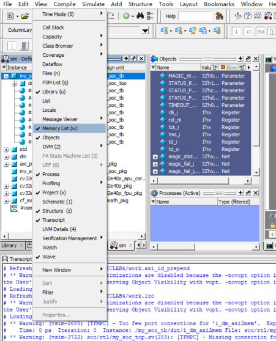
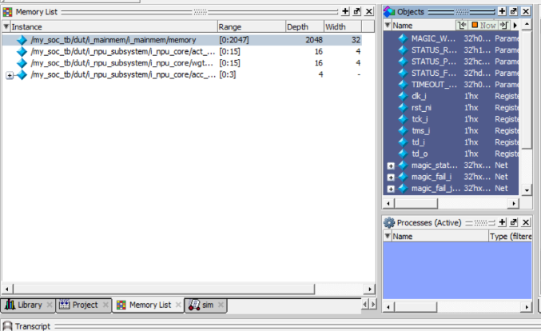
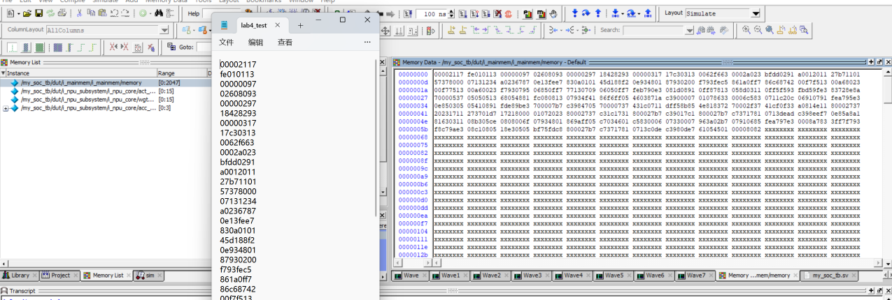
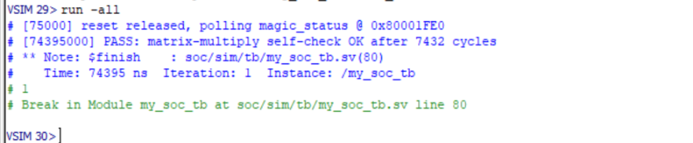
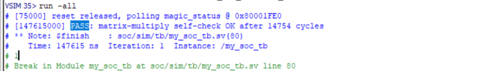
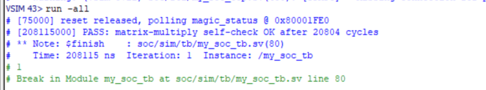

# Lab 3：SoC 的集成与仿真

!!! info "开始之前"
    - **主题**：把自己的 NPU 以 MMIO 方式挂到 SoC 上，并做 SoC 级仿真
    - **前置**：[Lab 1](lab-1.md)（`simple_npu_core`）、[Lab 2](lab-2.md)（SoC 结构与 ModelSim 流程）
    - **板卡**：无（纯 ModelSim 仿真）
    - **课时**：2 次实验课
    - **发布目录**：`lab3-ST/SoC_cv32e40p/`
    - **完成标准**：`lab3_test1/2/3.hex` 和 `lab3_hand.hex` 四个程序全部 PASS。**本实验不需要提交任何材料**

## 1. 实验目标

Lab 1 写的 `simple_npu_core` 是一个"核"：矩阵整个从端口进来，`start` 一拉就算，
结果整个从端口出去。Lab 1 讲义里提过，真实芯片不会这样用它——加速器挂在总线上，
CPU 跑程序，通过读写几个**地址**来喂数据、启动计算、取结果。

Lab 2 你已经见过这条总线：CPU 通过 AXI xbar 访问 bootram 和主存。
本实验要做的，就是在这条总线上再挂一个 slave——你的 NPU。

具体来说：

1. 把 Lab 1 的核改成 **4×4 输出驻留（output-stationary）脉动阵列**，端口不变
2. 给它写一层 **MMIO 壳**：把 CPU 一个 word 一个 word 的读写，翻译成核的 `start / act / wgt / out`
3. 修改 SoC 顶层，把 NPU 作为**第 4 个 slave** 接到 xbar 上
4. 用 C 程序和**手写汇编**两种方式驱动它，在 ModelSim 中完成 SoC 级仿真

完成本实验后你将理解：

- MMIO（Memory-Mapped I/O）：硬件就是一组"地址"，软件用普通的 load / store 访问它
- 怎样读懂、修改 xbar 的配置——master / slave 数量、地址映射
- 从一条 C 语句到总线上的一次读写，中间经过了哪些环节

## 2. 实验环境

| 项 | 说明 |
|---|---|
| 仿真器 | ModelSim（同 [Lab 2 §2](lab-2.md)） |
| 单元仿真 | Icarus Verilog（同 [Lab 0](lab-0.md)），也可以用 ModelSim |
| RISC-V 工具链 | 不需要安装，测试程序已编译好 |
| 发布代码 | `lab3-ST/SoC_cv32e40p/` |

发布目录结构：

```
SoC_cv32e40p/
├── cpu_cv32e40p/                   CV32E40P CPU（不需修改）
├── simple_npu/
│   ├── rtl/
│   │   └── simple_npu_top.sv       MMIO 壳骨架            <- Task 2
│   └── tb/
│       ├── tb_npu_check.sv         Lab 1 验收 tb（原样）   <- Task 1 自检
│       └── tb_simple_npu.sv        壳 + 核的单元 tb       <- Task 2 自检
└── soc/
    ├── rtl/
    │   ├── my_soc_top.sv           SoC 顶层                <- Task 3
    │   ├── my_npu_subsystem.sv     NPU 子系统包装（已写好）
    │   ├── include/my_soc_pkg.sv   地址空间常量            <- Task 3
    │   ├── axi/  mem/  debug/ ...  与 Lab 2 相同
    └── sim/
        ├── filelists/my_soc_tb.f   编译清单                <- Task 3
        ├── tb/
        │   ├── my_soc_tb.sv        SoC 顶层 testbench
        │   ├── lab3_test{1,2,3}.c  测试程序源码（只读）
        │   ├── lab3_test{1,2,3}.hex 编译好的程序镜像
        │   └── lab3_hand.hex       手写汇编示例            <- Task 5
        └── sw/                     反汇编、启动代码、链接脚本（思考题用）
```

你要写或改的文件：

| 文件 | Task |
|---|---|
| `simple_npu/rtl/simple_npu_core.sv`、`simple_npu_pe.sv` | 1（从你的 Lab 1 复制过来再改） |
| `simple_npu/rtl/simple_npu_top.sv` | 2 |
| `soc/rtl/my_soc_top.sv`、`soc/rtl/include/my_soc_pkg.sv`、`soc/sim/filelists/my_soc_tb.f` | 3 |

`soc/sim/tb/` 下的 testbench 和 `.c` / `.hex` 不要修改。

!!! note "和 Lab 2 包的区别"
    本实验的 SoC 就是 Lab 2 修好之后的样子（filelist、bootram、axi2mem、sram_ff 都已完成），
    只是目录组织不同：仿真相关文件在 `soc/sim/` 下，而不是根目录的 `sim/`。
    另外本包没有 `run_sim` 脚本，仿真命令见第 4 节。

## 3. 背景知识

Lab 2 §4 讲过的 AXI master / slave / xbar、axi2mem、同步读下一拍有效、启动流程、filelist，
本节不再重复，需要时回去翻。下面只讲新东西。

### 3.1 加上 NPU 之后的 SoC

```
   ┌─────────────────────────┐                ┌─────────────────────────┐
   │        CV32E40P         │                │      Debug Module       │
   ├────────────┬────────────┤                ├─────────────────────────┤
   │   instr    │    data    │                │         master          │
   └─────┬──────┴──────┬─────┘                └────────────┬────────────┘
         │             │                                   │
     slave[0]      slave[1]                             slave[2]
         └─────────────┴──────────┬────────────────────────┘
                                  │
      ┌───────────────────────────┴──────────────────────────────┐
      │                         axi_xbar                         │
      └──────┬──────────────┬──────────────┬──────────────┬──────┘
         master[0]      master[1]      master[2]      master[3]   <- 新增
             │              │              │              │
      ┌──────┴─────┐ ┌──────┴─────┐ ┌──────┴─────┐ ┌──────┴─────┐
      │  axi2mem   │ │  axi2mem   │ │  axi2mem   │ │  axi2mem   │
      │ i_axi2boot │ │ i_axi2sram │ │i_dm_axi2mem│ │ i_axi2npu  │
      └──────┬─────┘ └──────┬─────┘ └──────┬─────┘ └──────┬─────┘
             │              │              │              │
      ┌──────┴─────┐ ┌──────┴─────┐ ┌──────┴─────┐ ┌──────┴──────────┐
      │  bootram   │ │ my_mainmem │ │   dm_top   │ │my_npu_subsystem │
      │0x0001_0000 │ │0x8000_0000 │ │0x0000_0000 │ │   0x7000_0000   │
      └────────────┘ └────────────┘ └────────────┘ └──────┬──────────┘
                                                          │
                                                 ┌────────┴────────┐
                                                 │ simple_npu_top  │  壳（Task 2）
                                                 │ ┌─────────────┐ │
                                                 │ │simple_npu_  │ │  核（Task 1）
                                                 │ │   core      │ │
                                                 │ └─────────────┘ │
                                                 └─────────────────┘
```

和 Lab 2 的图相比只多了最右边一列：xbar 多一个 `master[3]` 端口，
经过 `i_axi2npu` 转成类存储器信号，接到 `my_npu_subsystem`。
**在总线看来，NPU 就是一块"特殊的存储器"**——它和主存用的是同一种 `axi2mem`，
区别只在于往某些地址写数据会触发计算，从某些地址读出来的是计算结果。

`my_npu_subsystem.sv` 已经写好，它只做一件事：把 `axi2mem` 那一侧的
`req / we / addr / wdata / rdata` 改名接到壳的 `ena / wea / addra / dina / douta` 上，
其中 `addra = addr_i[13:2]`（字节地址转成 word 地址，只保留 12 位）。

### 3.2 MMIO：硬件就是一组地址

C 程序里访问 NPU 是这样写的（摘自 `soc/sim/tb/lab3_test1.c`）：

```c
#define NPU_BASE     0x70000000u
#define NPU_CONTROL  (*(volatile uint32_t *)(NPU_BASE + 0x0000))
#define NPU_STATUS   (*(volatile uint32_t *)(NPU_BASE + 0x0004))
#define NPU_ACT(i)   (*(volatile uint32_t *)(NPU_BASE + 0x0040 + 4*(i)))

NPU_ACT(5) = 7;                                // 写
NPU_CONTROL = 1;                               // 写 1 启动
while ((NPU_STATUS & 1) == 0) { }              // 轮询直到 DONE
```

`NPU_ACT(5) = 7` 这一句，一路走下来是这样的：

```
C 语句      NPU_ACT(5) = 7
  │  编译
  ▼
机器指令    sw  a2, 0(a5)            a5 = 0x7000_0054, a2 = 7
  │  CPU 执行，数据口发出写请求
  ▼
CPU 数据口  data_req=1  data_we=1  data_addr=0x7000_0054  data_wdata=7
  │  axi_adapter 转成 AXI 写事务
  ▼
xbar        查 addr_map：0x7000_0054 落在 NPU 区间 -> 路由到 master[3]
  │
  ▼
i_axi2npu   npu_req=1  npu_we=1  npu_addr=0x7000_0054  npu_wdata=7   （只持续 1 拍）
  │  my_npu_subsystem：addra = addr[13:2]
  ▼
壳          ena=1  wea=1  addra=21 (=16+5)  dina=7   ->  act_reg[5] <= 7
```

读也一样，只是方向反过来：壳在下一拍把数据放到 `douta` 上，沿原路返回 CPU。

**关于 `volatile`**：对编译器来说，`*(uint32_t *)0x70000004` 只是一个普通内存地址。
如果不加 `volatile`，编译器看到 `while ((NPU_STATUS & 1) == 0)` 里反复读同一个地址、
中间没有任何写，就有权只读一次、然后死循环；看到连续两次写同一个地址，
也有权只保留最后一次。`volatile` 告诉编译器"这个地址的内容会在你不知道的时候变，
每次读写都必须真的发出去"。MMIO 寄存器必须用 `volatile` 访问。

### 3.3 MMIO 地址表

**这张表是冻结的**：测试程序已经按它编译成 hex，壳必须严格遵守。

| 寄存器 | 字节地址 | 壳看到的 `addra` | 读 / 写 | 含义 |
|---|---|---|---|---|
| `CONTROL` | `0x7000_0000` | `0` | 写 | 写入 bit[0] = 1 时启动一次计算；读返回 0 |
| `STATUS`  | `0x7000_0004` | `1` | 读 | bit[0] = DONE |
| `ACT[k]`  | `0x7000_0040 + 4k` | `16 + k` | 读写 | 矩阵 A，`ACT[j*4+i] = A[i][j]`，低 4 位有效 |
| `WGT[k]`  | `0x7000_1000 + 4k` | `1024 + k` | 读写 | 矩阵 B，`WGT[j*4+i] = B[i][j]`，低 4 位有效 |
| `OUT[k]`  | `0x7000_2000 + 4k` | `2048 + k` | 读 | 矩阵 C，`OUT[j*4+i] = C[i][j]`，低 10 位有效 |

k ∈ [0, 15]。打包规则和 Lab 1 完全一样（列优先），所以 `ACT[k]` 就对应核的 `act[k]`，
`OUT[k]` 就对应核的 `out[k]`，壳里不需要做任何下标变换。

没列在表里的地址：读返回 0，写忽略。

### 3.4 axi2mem 对壳的时序约束

壳的端口就是 Lab 2 §4.3 那组类存储器信号（只是改了名字），所以它必须遵守和
`sram_ff` 一样的契约，外加两条 MMIO 特有的：

| 端口 | 含义 |
|---|---|
| `clka` / `rst_ni` | 时钟 / 异步低有效复位 |
| `ena` | 本拍有访问（= axi2mem 的 `req_o`） |
| `wea` | 1 = 写，0 = 读 |
| `addra[11:0]` | word 地址 |
| `dina[31:0]` | 写数据 |
| `douta[31:0]` | 读数据，**请求后下一拍有效** |

1. **读数据下一拍有效**。和 Lab 2 的 `sram_ff` 完全一样：请求在 cycle T，
   `douta` 在 T+1 给出。做法是先组合选出要读的数，再打一拍寄存器。
2. **写只看 `ena && wea` 的那一拍**。`ena = 0` 时 `dina` 上可能是任意值，
   所以所有写操作都要用 `ena && wea` 门控。
3. **一次写就是一拍**。CPU 写一次 `CONTROL`，壳只会看到一拍 `ena && wea`，
   所以 `ena && wea && (addra == 0) && dina[0]` 天然就是一个单拍脉冲，
   可以直接接到核的 `start` 上。
4. **读不要有副作用**。`axi2mem` 在 READ 状态下只要总线侧还没接收数据（`r_ready = 0`），
   就会保持 `req_o = 1`、地址不变（见 `soc/rtl/axi/axi2mem.sv` 第 175~187 行），
   也就是说**同一次读，壳可能看到不止一拍请求**。如果"读 STATUS"会改变壳的状态
   （例如读一次就把 DONE 清掉），那么一次读就可能被当成两次。
   在本实验的 SoC 里 CPU 总是立刻接收读数据，实测不会出现重复的读请求；
   但壳不应该依赖"上游恰好很快"这种前提。
   Lab 1 的核 `done` 是 sticky 的（保持到下次 `start`），STATUS 直接接它就没有这个问题。

### 3.5 读懂 xbar 的配置

`my_soc_top.sv` 开头这一段决定了"总线上有几个 master、几个 slave、每个 slave 占哪段地址"。
Task 3 要改的就是这里，先逐项看懂：

```systemverilog
AXI_BUS #(.AXI_ADDR_WIDTH(32), .AXI_DATA_WIDTH(32),
          .AXI_ID_WIDTH  (2),  .AXI_USER_WIDTH(1)) slave[2:0]();   // (1)
AXI_BUS #(.AXI_ADDR_WIDTH(32), .AXI_DATA_WIDTH(32),
          .AXI_ID_WIDTH  (4),  .AXI_USER_WIDTH(1)) master[2:0]();  // (2)

localparam axi_pkg::xbar_cfg_t AXI_XBAR_CFG = '{
    NoSlvPorts:         3,      // (3)
    NoMstPorts:         3,      // (4)
    ...
    AxiIdWidthSlvPorts: 2,      // (5)
    ...
    NoAddrRules:        3       // (6)
};

axi_pkg::xbar_rule_32_t [2:0] addr_map;                             // (7)

localparam int IDX_BOOT = 0;
localparam int IDX_SRAM = 1;
localparam int IDX_DM   = 2;

assign addr_map = '{                                                // (8)
    '{ idx: IDX_BOOT, start_addr: BOOT_BASE, end_addr: BOOT_BASE + BOOT_LENGTH },
    '{ idx: IDX_SRAM, start_addr: SRAM_BASE, end_addr: SRAM_BASE + SRAM_LENGTH },
    '{ idx: IDX_DM,   start_addr: DM_BASE,   end_addr: DM_BASE   + DM_LENGTH   }
};
```

- **(1)(2)(3)(4)** 命名方向在 Lab 2 §4.2 讲过：名字是站在 xbar 自己的角度起的。
  `slave[]` 是 xbar 的"从端口"，接的是真正的 master（CPU 取指、CPU 访存、debug），
  所以 `NoSlvPorts` = **master 的个数** = 3；
  `master[]` 是 xbar 的"主端口"，接的是真正的 slave（bootram、主存、debug），
  所以 `NoMstPorts` = **slave 的个数**。`master[]` 数组的大小必须和 `NoMstPorts` 一致。
- **(5) 为什么 `slave[]` 的 ID 是 2 位，`master[]` 的 ID 是 4 位？**
  3 个 master 各自发出的请求带 2 位 ID。经过 xbar 之后，同一个 slave 可能同时收到来自
  不同 master 的请求，slave 回响应时 xbar 必须知道"这个响应该还给谁"。
  所以 xbar 在 ID 前面拼上了来源端口号：3 个端口需要 `$clog2(3) = 2` 位，
  2 + 2 = 4（见 `soc/rtl/axi/axi_xbar.sv` 第 257 行
  `AxiIdWidthMstPorts = AxiIdWidthSlvPorts + $clog2(NoSlvPorts)`）。
  **加 slave 不影响 ID 位宽**，加 master 才会。
- **(6)(7)(8)** 地址映射规则。每条规则写明"哪个编号的 slave、起始地址、结束地址"。
  `NoAddrRules` 是规则条数，`addr_map` 数组大小要和它一致。
  注意 **`end_addr` 不包含在范围内**（`soc/rtl/axi/addr_decode.sv` 第 92 行：
  `addr >= start_addr && addr < end_addr`），所以写成 `BASE + LENGTH` 正好。
- 地址常量 `BOOT_BASE` 等定义在 `soc/rtl/include/my_soc_pkg.sv`。
- **落在所有规则之外的访问**会被 xbar 交给内部的 `axi_err_slv`，
  它对读请求返回固定的数据 `0xBADCAB1E`（"bad cable"）。
  在波形或寄存器里看到这个数，基本可以断定"这个地址没有映射到任何 slave"。

### 3.6 从广播到脉动阵列

Lab 1 的核在第 k 拍把 A 的第 k 列**广播**给 4 行 PE、把 B 的第 k 行广播给 4 列 PE：
一根 `A[i][k]` 的线要同时拉到同一行的 4 个 PE。4×4 的时候没问题，
阵列一大，这些长线和大扇出就会成为时序瓶颈。

**脉动阵列（systolic array）** 的思路是：每个 PE 只和**相邻**的 PE 交换数据。

```
            b 从上往下流（每经过一个 PE 延迟 1 拍）
               ↓          ↓          ↓          ↓
 a 从左   → [PE00] → [PE01] → [PE02] → [PE03]
 往右流   → [PE10] → [PE11] → [PE12] → [PE13]
          → [PE20] → [PE21] → [PE22] → [PE23]
          → [PE30] → [PE31] → [PE32] → [PE33]
```

- 每个 PE 仍然锁定一个 `C[i][j]`，仍然是 `acc <= acc + a*b`（**输出驻留**不变）
- 多出来的是两个**传递寄存器**：把这一拍收到的 `a` 打一拍交给右边，把 `b` 打一拍交给下边
- A 的第 i 行只从最左边送进第 i 行；B 的第 j 列只从最上边送进第 j 列

问题来了：`A[i][k]` 从左边进来，要走 j 拍才到 `PE[i][j]`；`B[k][j]` 从上边进来，
要走 i 拍才到。为了让同一个 k 的一对数据**同时**到达 `PE[i][j]`，
边沿输入要做**斜排（skew）**：第 i 行比第 0 行晚 i 拍开始送，第 j 列比第 0 列晚 j 拍开始送。

按这个规则，RUN 的第 t 拍（从 0 数）：

| 边沿 | 第 t 拍送入 |
|---|---|
| 第 i 行左边 | `A[i][t-i]`，当 `0 ≤ t-i ≤ 3`；否则送 0 |
| 第 j 列上边 | `B[t-j][j]`，当 `0 ≤ t-j ≤ 3`；否则送 0 |

于是 `PE[i][j]` 在第 **t = i + j + k** 拍同时拿到 `A[i][k]` 和 `B[k][j]`。例如：

| | k=0 | k=1 | k=2 | k=3 |
|---|---|---|---|---|
| `PE[0][0]` 在第几拍累加 | 0 | 1 | 2 | 3 |
| `PE[1][2]` 在第几拍累加 | 3 | 4 | 5 | 6 |
| `PE[3][3]` 在第几拍累加 | 6 | 7 | 8 | 9 |

最后一个 PE 在第 9 拍才做完最后一次累加，所以 **RUN 要持续 3N-2 = 10 拍**，而不是 4 拍。
在波形上，16 个 PE 的 `acc` 会像一道"对角线波前"一样从左上角推到右下角。

除了 RUN 变长，其他规格**全部照搬 Lab 1**：`done` sticky、结果驻留在 PE 里、
连续多次运行不复位、`start` 进来时清掉累加器。端口签名一个字都不改，
所以 Lab 1 的 `tb_npu_check.sv` 可以原样拿来验收。

!!! tip "送 0 为什么就行"
    斜排窗口外送的是 0，0 乘任何数都是 0，加进 `acc` 不影响结果。
    所以你不需要让每个 PE 知道"现在该不该累加"——整个 RUN 期间 16 个 PE 都开着 `en`，
    该算的时候拿到的是真数据，不该算的时候拿到的是 0。

### 3.7 PASS / FAIL 的判定

Lab 2 的 tb 是**监听主存写端口**，看到 magic 值被写进主存就判定结果，
因为 magic 变量的地址由链接器分配，每次编译都可能变。

本实验的测试程序换了一种做法：把结果写到**固定地址** `0x8000_1FE0` 开始的一小块区域
（主存的最顶端，链接脚本 `soc/sim/sw/linker.ld` 把栈顶放在它下面，保证不会被栈踩到）：

| 地址 | 内容 |
|---|---|
| `0x8000_1FE0` | `magic_status`：`0x12345678` 运行中，`0xC0DEC0DE` PASS，`0xDEADBEEF` FAIL |
| `0x8000_1FE4` | 出错时的行号 i |
| `0x8000_1FE8` | 出错时的列号 j |
| `0x8000_1FEC` | NPU 读出的值 |
| `0x8000_1FF0` | 软件算出的参考值 |
| `0x8000_1FF4` | 第几组测试出的错（test2 / test3） |

`soc/sim/tb/my_soc_tb.sv` 每拍直接读主存数组的这几个位置，看到 PASS / FAIL 就结束仿真，
跑满 100 万拍还没结果就报 TIMEOUT。两种做法的优劣见思考题。

## 4. 仿真流程

和 [Lab 2 §5.4 手动分步执行](lab-2.md) 相同，只是路径换成 `soc/sim/...`。
在 `SoC_cv32e40p/` 目录下打开 ModelSim（GUI 或 `vsim -c` 都可以），在 Transcript 里输入：

```tcl
vlib work
vmap work work
file mkdir soc/sim/out
vlog -sv -f soc/sim/filelists/my_soc_tb.f
vsim -suppress 12110 -novopt work.my_soc_tb
run -all
```

**切换测试程序**：主存加载哪个 hex 由 `soc/rtl/mem/my_mainmem.sv` 的 `INIT_FILE` 参数决定，
默认是 `soc/sim/tb/lab3_test1.hex`。不用改文件，在 `vsim` 时用 `-G` 覆盖即可：

```tcl
quit -sim
vsim -suppress 12110 -novopt -GINIT_FILE=soc/sim/tb/lab3_test2.hex work.my_soc_tb
run -all
```

只改了某个 RTL 文件时，`quit -sim` 后单独 `vlog -sv <那个文件>` 再 `vsim` 即可，不用全部重编。

!!! warning "关于波形文件"
    `my_soc_tb.sv` 每次都会把全部信号写进 `soc/sim/out/my_soc_tb.vcd`。实测一次 test1（约 7 千拍）
    就有 150 MB 左右，每 2 万拍约 360 MB。**TIMEOUT 要跑满 100 万拍，VCD 会有十几 GB**，
    又慢又占磁盘。所以：

    - 预期会 TIMEOUT、或者正在调试的时候，**不要用 `run -all`**，用 `run 200us`（约 2 万拍）
      就足够看清发生了什么
    - 如果你觉得太慢，尝试学习 Lab 2 的 `sim/tb/my_soc_tb.sv` 是怎么把 VCD 导出变成可选的
      （提示：`$test$plusargs`），然后自己改 tb 里那两行 `$dumpfile / $dumpvars`。
      这两行之外的判定逻辑不要动
    - ModelSim GUI 看波形用的是它自己的 WLF，不依赖这个 VCD

**层次路径**：本实验常用的几个观察点。

| 想看什么 | 路径 |
|---|---|
| CPU 数据口 | `/my_soc_tb/dut/data_req`、`data_we`、`data_addr`、`data_wdata`、`data_rdata` |
| CPU 取指 | `/my_soc_tb/dut/instr_addr`、`instr_rdata` |
| xbar 通往 NPU 的 AXI | `/my_soc_tb/dut/master[3]/aw_addr`、`aw_valid`、`ar_addr`、`ar_valid`、`r_data`… |
| axi2mem 之后 | `/my_soc_tb/dut/npu_req`、`npu_we`、`npu_addr`、`npu_wdata`、`npu_rdata`（Task 3 你自己声明的名字） |
| 壳内部 | `/my_soc_tb/dut/i_npu_subsystem/i_npu_core/...` |
| CPU 寄存器堆 | `/my_soc_tb/dut/i_cpu/core_i/id_stage_i/register_file_i/mem`（`mem[5]` 是 t0，`mem[28]` 是 t3……） |
| magic 区域 | `/my_soc_tb/magic_status`、`magic_fail_i`、`magic_fail_j`、`magic_hw`、`magic_ref` |

查看主存内容（看 hex 有没有加载进去）的方法和 Lab 2 Task 4 自检里一样：
`View → Memory List`，双击 `/my_soc_tb/dut/i_mainmem/i_mainmem/memory`。







!!! note "关于这三张图"
    截图仅作示例，图中的文件名 `lab4_test` 可能过期，本实验中为 `lab3_test`，
    其余层次路径和操作一致。图里 Memory List 中 NPU 内部数组的名字取决于你自己的实现。

## 5. 实验任务

### Task 0 · 先跑一次，看看"没有 NPU"的 SoC 会怎样

**要求**：不改任何文件，按第 4 节编译运行 test1，但用 `run 200us` 代替 `run -all`。

**你会看到**：只打印了一行 `reset released`，之后没有 PASS 也没有 FAIL，程序没跑完。

**去波形里找原因**：加上 CPU 数据口的信号

```tcl
add wave /my_soc_tb/dut/data_req /my_soc_tb/dut/data_we /my_soc_tb/dut/data_addr /my_soc_tb/dut/data_wdata /my_soc_tb/dut/data_rdata
```

（GUI 模式下需要在 `run` 之前先 `log -r /*`，否则事后加的信号是 "No Data"，同 Lab 2 §5.2。）

你应该能看到：

1. CPU 先对 `0x7000_0040`、`0x7000_1000`…… 发了一串写（在装载 ACT / WGT），
   又对 `0x7000_0000` 写了 1（START）
2. 然后反复读 `0x7000_0004`（轮询 STATUS），每次读回来的都是 **`0xBADCAB1E`**
3. `0xBADCAB1E` 的 bit[0] 是 0，程序认为"还没算完"，永远轮询下去

这正是 §3.5 最后一条：`0x7000_xxxx` 不在 xbar 的任何一条地址规则里，
所有访问都被 `axi_err_slv` 接走了——写被默默丢掉，读返回 `0xBADCAB1E`。
接下来的三个 Task 就是让这些访问真正落到你的 NPU 上。

### Task 1 · 把核改成脉动阵列

**位置**：`simple_npu/rtl/simple_npu_core.sv`、`simple_npu/rtl/simple_npu_pe.sv`
（先把你 Lab 1 做好的这两个文件复制进来）

**要求**：按 §3.6 改成 4×4 输出驻留脉动阵列。

- `simple_npu_core` 的模块名和 7 个端口**一个字都不改**
- PE 的端口随你改（增加 `a_o / b_o` 之类的传递输出）
- RUN 持续 10 拍；`done` sticky；`start` 时清累加器；RUN 期间的 `start` 忽略

**自检**：用 Lab 1 的验收 tb 原样跑（在 `SoC_cv32e40p/` 目录下）：

```bash
iverilog -g2012 -s tb_npu_check -o check.vvp simple_npu/rtl/simple_npu_pe.sv simple_npu/rtl/simple_npu_core.sv simple_npu/tb/tb_npu_check.sv
vvp check.vvp
```

全部通过时的参考输出：

```text
[CHECK] TEST1 PASS  (20 cycles)
[CHECK] TEST2 PASS  (40 cycles)
[CHECK] TEST3 PASS  (60 cycles)
[CHECK] ALL PASS  (total 126 cycles)
```

对照 Lab 1 的 14 / 28 / 42：每次 GEMM 多了 6 拍，正好是 RUN 从 4 拍变成 10 拍。
**如果你的数字还是 14 / 28 / 42，说明你交上来的还是广播版。**
每次 GEMM 差 1~2 拍是正常的（例如 `start` 先寄存一拍再用）。

**打开 `npu_check.vcd` 看一眼对角波前**：把 `PE[0][0]`、`PE[1][2]`、`PE[3][3]` 的 `acc`
加进波形，设成无符号十进制，对照 §3.6 的表，看它们分别在 RUN 的第几拍开始变、第几拍停。

**常见错误**（下表每一行都是在参考实现上人工注入 bug 实测出来的）：

| 现象 | 最可能的原因 |
|---|---|
| 14 / 28 / 42 拍，ALL PASS | 还是广播版，没改成脉动 |
| TEST1 就 MISMATCH，只有 `C[0][0]` 一定对，其余大多不对 | **没有斜排**：所有行 / 列在同一拍开始送。只有 `PE[0][0]` 两个方向都不需要走路，所以只有它对 |
| TEST1 MISMATCH，越靠右下角越错，`C[3][x]`、`C[x][3]` 读出 0 或偏小 | **RUN 太短**（例如还是 4 拍），数据还没流到右下角就停了 |
| **只有 `C[3][3]` 不对**，而且偏小 | **RUN 少了 1 拍**（9 拍），最后一次累加没做 |
| `C[i][j]` 读出来是 `C[j][i]` 的值 | `acc` 接到 `out` 时 i / j 反了，应为 `out[j*4+i]`（同 Lab 1） |

### Task 2 · 写 MMIO 壳

**位置**：`simple_npu/rtl/simple_npu_top.sv`（骨架已给出端口和地址常量）

**要求**：在 `// NEED TO BE DONE` 处实现，端口签名不改。壳里至少要有：

1. **地址译码**：根据 `addra` 判断这次访问落在 §3.3 表里的哪个寄存器
2. **ACT / WGT 寄存器组**：`ena && wea` 且命中 ACT 区时，把 `dina[3:0]` 写进对应槽位，WGT 同理。
   建议直接声明成 packed 数组 `logic [15:0][3:0] act_reg;`，可以原样接到核的 `act` 端口
3. **START**：`ena && wea` 且写 CONTROL、`dina[0] == 1` 时，产生一拍 `start` 给核
4. **例化 `simple_npu_core`**
5. **读路径**：`ena && !wea` 时，按地址选出 STATUS（`{31'b0, done}`）、ACT、WGT、OUT
   （`{22'b0, out[k]}`）之一；其余地址返回 0。**选出来之后打一拍再送到 `douta`**（§3.4 第 1 条）

**自检**：助教提供的单元 tb 按 `axi2mem` 的时序驱动壳的端口，跑 3 组数据：

```bash
iverilog -g2012 -s tb_simple_npu -o npu.vvp simple_npu/rtl/simple_npu_pe.sv simple_npu/rtl/simple_npu_core.sv simple_npu/rtl/simple_npu_top.sv simple_npu/tb/tb_simple_npu.sv
vvp npu.vvp
```

看到 `[TB] ALL PASS` 即完成。文件名以你自己的为准。

| 现象 | 最可能的原因 |
|---|---|
| `CASE0 FAIL: timeout waiting DONE`，所有 OUT 读出 0 | 读路径没打拍（写成了组合的 `assign douta = ...`）。tb 在下一拍才采样，那时 `ena` 已经是 0，组合逻辑选出来的是 0 |
| DONE 能等到，但 OUT 全是 0 | ACT / WGT 没写进去：检查写使能是不是用了 `ena && wea`、地址区间对不对 |
| 第一组对，后面的组不对 | 核的累加器没在 `start` 时清零（回 Task 1），或者 `start` 不是单拍 |

### Task 3 · 把 NPU 挂到 SoC 上

**位置**：`soc/rtl/my_soc_top.sv`、`soc/rtl/include/my_soc_pkg.sv`、`soc/sim/filelists/my_soc_tb.f`

**要求**：让 xbar 多一个 slave，地址 `0x7000_0000 ~ 0x7FFF_FFFF`，经过一个新的 `axi2mem`
接到 `my_npu_subsystem`。`my_soc_top.sv` 末尾留了一段 `TODO (Lab3 Task 3)` 注释标出位置，
但**要改的地方不止那一处**。按 §3.5 逐项检查，一共 7 处：

| # | 文件 | 改什么 |
|---|---|---|
| 1 | `my_soc_pkg.sv` | 新增 `NPU_BASE = 32'h7000_0000`、`NPU_LENGTH = 32'h1000_0000` |
| 2 | `my_soc_top.sv` | `master[2:0]` → `master[3:0]` |
| 3 | `my_soc_top.sv` | `NoMstPorts: 3` → `4` |
| 4 | `my_soc_top.sv` | `NoAddrRules: 3` → `4`，`addr_map` 数组 `[2:0]` → `[3:0]` |
| 5 | `my_soc_top.sv` | 新增 `IDX_NPU = 3`，`addr_map` 里加第 4 条规则 |
| 6 | `my_soc_top.sv` | 声明 `npu_req / npu_we / npu_addr / npu_wdata / npu_rdata`，例化 `axi2mem i_axi2npu` 和 `my_npu_subsystem i_npu_subsystem` |
| 7 | `my_soc_tb.f` | 加入 `simple_npu/rtl/` 下你的文件和 `soc/rtl/my_npu_subsystem.sv`，放在 `soc/rtl/my_soc_top.sv` 之前 |

第 6 步直接照抄主存那一路（`i_axi2sram` + `i_mainmem`）的写法，注意三处不同：

- `.slave (master[IDX_NPU])`
- 复位用 `ndmreset_n`，和主存那一路一样
- `be_o` 可以空着不接（`.be_o ()`），原因见思考题

`my_npu_subsystem` 的端口打开 `soc/rtl/my_npu_subsystem.sv` 看，只有 7 个。

**自检**：按第 4 节跑 test1，看到

```
# [75000] reset released, polling magic_status @ 0x80001FE0
# [74395000] PASS: matrix-multiply self-check OK after 7432 cycles
```



**漏改某一处会怎样**（每一行都是实测）：

| 漏了哪一步 | 现象 |
|---|---|
| 1 没加 `NPU_BASE` | `vlog` 报 `(vlog-2730) Undefined variable: 'NPU_BASE'` |
| 2 `master` 还是 `[2:0]` | `vsim` 报 `(vsim-3042) Index 3 is out of range for the instance array 'master'` |
| 3 `NoMstPorts` 还是 3 | `vsim` 报 `** Fatal: (vsim-3698) ... The interface array port 'mst_ports' of size 3 must be passed an identical array` |
| 4 `NoAddrRules` 还是 3 | **能编译能跑**，只有一个 warning `(vsim-3015) Port size (288) does not match connection size (384) for port 'addr_map_i'`。xbar 只收到 3 条规则，**bootram 那条被挤掉了**：CPU 复位后取指就拿到 `0xBADCAB1E`，程序根本没开始，TIMEOUT 时 `magic_status` 是 `x` |
| 5 `addr_map` 扩成 4 条但没写第 4 条 | `** Fatal: This rule has a higher start than end address!!!`（没写的那条是全 0） |
| 6 忘了例化 `i_axi2npu` | 能编译能跑，TIMEOUT，`magic_status = 0x12345678`：CPU 第一次访问 NPU 就再也没有返回，`master[3]` 上的请求没人应答 |
| 6 `data_o` / `data_i` 接反 | `vsim` 报 `(vsim-3839) Variable '/my_soc_tb/dut/npu_rdata', driven via a port connection, is multiply driven` |
| 7 filelist 没加 `my_npu_subsystem.sv` | `vsim` 报 `(vsim-3033) Instantiation of 'my_npu_subsystem' failed. The design unit was not found` |
| `NPU_LENGTH` 写小了（比如 `32'h2000`） | ACT / WGT / STATUS 都正常，读 OUT（`0x7000_2000`）时落到了区间外：`FAIL ... hw=798 ref=250`。798 = `0x31E` = `0xBADCAB1E` 的低 10 位 |

!!! tip "为什么第 4 条最阴险"
    编译器只给了一个 warning，仿真也能跑，现象却出现在一个完全不相关的地方（取指失败）。
    SoC 集成里大多数难查的问题都是这种：错误发生的位置和表现出来的位置隔得很远。
    养成习惯：**改完顶层先看一遍 `vsim` 的 warning**，特别是 `Port size does not match`。

### Task 4 · SoC 级仿真：跑通三个测试，看清一次 MMIO 访问

**4.1 跑 test2、test3**（切换方法见第 4 节）：

| 测试 | 内容 | 参考 cycle 数 |
|---|---|---|
| `lab3_test1.hex` | 单次 GEMM | 7432 |
| `lab3_test2.hex` | 连续 2 次（单位阵 × dense，dense × dense） | 14754 |
| `lab3_test3.hex` | 连续 3 次（最后一次全 15 × 全 15，结果 900） | 20804 |





!!! note "关于 cycle 数"
    上面三张截图仅作示例，截图所用的核是 RUN 只有 4 拍的广播式实现，但参考 cycle 数和脉动阵列版**完全一样**。
    原因是 CPU 发出 START 之后，第一次读 STATUS 要十几拍才走完总线来回，
    10 拍的 RUN 早就结束了——RUN 多出来的 6 拍被总线延迟"吸收"了。
    你的数字和参考值差几十拍以内都正常。

test1 过了但 test2 / test3 FAIL，看 FAIL 那一行的 `case=`：
`case=1` 或 `case=2` 出错而 `case=0` 没错，多半是连续运行时累加器没清零或 `done` 没随 `start` 清掉；
只有 test3 的 `case=2` 错，是 900 装不下（累加器位宽不够）。这些 Task 1 的 tb 本该抓到，回去对照。

**4.2 跟踪一次 MMIO 写和一次 MMIO 读**

跑 test1（GUI，`run` 之前 `log -r /*`），把下面四层信号加进波形：

```tcl
add wave -group cpu  /my_soc_tb/dut/data_req /my_soc_tb/dut/data_gnt /my_soc_tb/dut/data_we /my_soc_tb/dut/data_addr /my_soc_tb/dut/data_wdata /my_soc_tb/dut/data_rvalid /my_soc_tb/dut/data_rdata
add wave -group axi  {/my_soc_tb/dut/master[3]/aw_valid} {/my_soc_tb/dut/master[3]/aw_addr} {/my_soc_tb/dut/master[3]/w_data} {/my_soc_tb/dut/master[3]/ar_valid} {/my_soc_tb/dut/master[3]/ar_addr} {/my_soc_tb/dut/master[3]/r_valid} {/my_soc_tb/dut/master[3]/r_data}
add wave -group mem  /my_soc_tb/dut/npu_req /my_soc_tb/dut/npu_we /my_soc_tb/dut/npu_addr /my_soc_tb/dut/npu_wdata /my_soc_tb/dut/npu_rdata
add wave -group npu  /my_soc_tb/dut/i_npu_subsystem/i_npu_core/*
```

然后：

1. 在波形里找到 CPU **第一次**写 NPU（`data_addr = 0x70000040`），沿四层往下看，
   写数据什么时候出现在 AXI 上、什么时候 `npu_req` 拉高、壳里哪个寄存器在哪一拍变了
2. 找到 CPU 第一次读到 `STATUS = 1` 的那次读，看 `npu_rdata` 比 `npu_req` 晚几拍、
   `data_rdata` 又比它晚几拍
3. 数一数：CPU 发起一次 NPU 访问到拿到结果，一共花了几拍？（参考：写和读都在 6 拍左右）

**4.3 在反汇编里找到这条指令**

打开 `soc/sim/sw/lab3_test1.dump`，找到 `NPU_ACT(j * N + i) = A[i][j];` 这一行 C 代码
下面对应的 `sw` 指令，记下它的地址。回到波形，看 `/my_soc_tb/dut/instr_addr`：
CPU 取这条指令的时刻，和 4.2 里第一次写 NPU 的时刻差了多少？为什么不是同一拍？

**4.4 在 SoC 里看对角波前**

在 `i_npu_core` 下找到你的核，把 `PE[0][0]` 和 `PE[3][3]` 的 `acc` 加进波形，
找到 START 之后的那十几拍，确认它们的累加时刻和 §3.6 的表一致。

### Task 5 · 不用 C，用汇编直接访问 NPU

前面的测试程序都是 C 编译出来的，一条 C 语句会变成好几条指令，中间还夹着循环和栈操作，
在波形里不好一一对应。这个 Task 用**手写汇编**把 MMIO 访问剥到最干净。

`soc/sim/tb/lab3_hand.hex` 是助教写好的示例，源码在 `soc/sim/sw/lab3_hand.S`。它只做一件事：

```asm
    lui  t0, 0x70000        # t0 = 0x7000_0000 (NPU_BASE)
    addi t1, zero, 3
    sw   t1, 0x40(t0)       # ACT[0] = A[0][0] = 3
    lui  t2, 0x70001        # t2 = 0x7000_1000 (WGT_BASE)
    addi t1, zero, 5
    sw   t1, 0(t2)          # WGT[0] = B[0][0] = 5
    lw   t3, 0x40(t0)       # 读回 ACT[0]，t3 应为 3
    addi t1, zero, 1
    sw   t1, 0(t0)          # CONTROL = 1 (START)
poll:
    lw   t1, 4(t0)          # 读 STATUS
    andi t1, t1, 1
    beq  t1, zero, poll     # DONE 还没到就回去再读
    lui  t2, 0x70002        # t2 = 0x7000_2000 (OUT_BASE)
    lw   t4, 0(t2)          # t4 = OUT[0] = C[0][0]，应为 15
    ...                     # 比较 t4 和 15，对就往 0x8000_1FE0 写 0xC0DEC0DE
```

没有 `startup.S`、没有栈，bootram 跳到 `0x8000_0000` 之后直接执行第一条。

**5.1 跑通示例**：

```tcl
vsim -suppress 12110 -novopt -GINIT_FILE=soc/sim/tb/lab3_hand.hex work.my_soc_tb
run -all
```

应当在 200 多拍内 PASS。然后看寄存器堆：

```tcl
examine -radix hex {/my_soc_tb/dut/i_cpu/core_i/id_stage_i/register_file_i/mem[28]}
examine -radix hex {/my_soc_tb/dut/i_cpu/core_i/id_stage_i/register_file_i/mem[29]}
```

`mem[28]`（t3）应为 `3`，是从 ACT[0] 读回来的；`mem[29]`（t4）应为 `0xf`，是 NPU 算出来的 `C[0][0]`。

**5.2 自己改一版**：`lab3_hand.hex` 是纯文本，一行一条指令，右边 `//` 后面是注释
（`$readmemh` 会忽略）。复制一份，改成你自己的程序，例如：

- 把 A 的第 0 行、B 的第 0 列都填上数，让 `C[0][0]` 变成 4 项之和
- 读一个 `OUT[k]` 以外的结果，比如 `C[1][2]` 在哪个地址？
- 连续 START 两次，第二次换一组 WGT，看结果对不对

汇编转机器码用 Lab 2 用过的在线工具 <https://riscvasm.lucasteske.dev>。
改完用 `-GINIT_FILE=` 指向你的文件运行。PASS 条件由你自己的程序决定：
只要往 `0x8000_1FE0` 写入 `0xC0DEC0DE`，tb 就判 PASS。

!!! tip "两个在线工具不会告诉你的细节"
    - 32 位立即数要拆成 `lui`（高 20 位）+ `addi`（低 12 位）。`addi` 的立即数是**有符号**的，
      低 12 位 ≥ `0x800` 时会被当成负数，`lui` 那一半要加 1。
      示例里的 `0xDEADBEEF` 就是这样拆的：`lui t1, 0xDEADC` + `addi t1, t1, -0x111`
    - 跳转和分支的偏移是相对于**当前指令地址**的，在线工具默认程序从 0 开始，
      这不影响结果（偏移是相对的），但工具显示的绝对地址要加上 `0x8000_0000` 才是实际地址

**5.3 选做：探索未映射的地址**

写一小段汇编，分别读下面三个地址，把结果放进 `a0 / a1 / a2`，再用 `examine` 看：

| 地址 | 预期 | 为什么 |
|---|---|---|
| `0x7000_0080` | ? | 在 NPU 区间内，但不在 §3.3 表里 |
| `0x7000_4040` | ? | 提示：壳只看 `addr[13:2]` |
| `0x6000_0000` | ? | 不在任何地址规则里 |

先自己推理，再用仿真验证。

**5.4 选做：自己写一个总线监视器**

在 `my_soc_tb.sv` 之外新建一个模块（例如 `npu_mon.sv`），用层次路径观察 `dut.npu_req / npu_we /
npu_addr / npu_wdata / npu_rdata`，每次 NPU 访问打印一行：时间、读还是写、哪个寄存器、数据是多少。
编译时把它加在 filelist 后面，`vsim` 时写 `vsim ... work.my_soc_tb work.npu_mon` 同时加载两个顶层。
有了它，调试时不用翻波形，transcript 里就能看到 CPU 对 NPU 做的每一件事。
提示：读数据要等下一拍才出现在 `npu_rdata` 上。

## 6. 推进顺序与分步自检

和 Lab 2 一样，Task 的编号就是推荐顺序，每一步都能单独验证：

```
Task 0  原样跑                目标：看到 CPU 读 NPU 得到 0xBADCAB1E
Task 1  脉动阵列核            目标：tb_npu_check ALL PASS，20 / 40 / 60 拍
Task 2  MMIO 壳               目标：tb_simple_npu ALL PASS
Task 3  挂到 SoC 上           目标：lab3_test1 PASS
Task 4  SoC 级仿真            目标：lab3_test2 / test3 PASS，能在波形里跟踪一次访问
Task 5  手写汇编              目标：lab3_hand PASS，t3 = 3、t4 = 15
```

顺序是**从里往外**：先确认核算得对，再确认壳和总线的约定对，最后才接到 SoC 上。
Task 3 如果出问题，你可以确定核和壳是好的，只需要查顶层那 7 处改动。
反过来，如果跳过 Task 1、2 直接接 SoC，一个 FAIL 可能来自核、壳、顶层任何一层，
而 SoC 仿真一次要跑几十秒，比单元 tb 慢上百倍。

## 7. 完成标志

四个程序全部 PASS：

| 程序 | 参考 |
|---|---|
| `lab3_test1.hex` | PASS，约 7432 cycles |
| `lab3_test2.hex` | PASS，约 14754 cycles |
| `lab3_test3.hex` | PASS，约 20804 cycles |
| `lab3_hand.hex` | PASS，约 208 cycles，`t3 = 3`、`t4 = 0xf` |

本实验不需要提交任何材料。**把 `simple_npu/rtl/` 和改好的 `soc/` 留好**，后续 Lab 会用到。

## 8. 思考题

以下问题不需要提交，供自行检验理解程度。

### 8.1 C 代码是怎么变成 hex 的

本实验不要求你安装 RISC-V 工具链，但 `soc/sim/sw/` 里留下了编译过程的中间产物
（见该目录的 `README.md`）。只看这些文件，回答：

1. `lab3_test1.hex` 的第 1 行是 `00002117`，它是哪个文件里的哪条指令？做什么用？
2. 谁决定了程序从 `0x8000_0000` 开始放？如果把它改成 `0x8000_1000`，bootram 需要跟着改吗？
3. 在 `lab3_test1.dump` 里找到 `main` 的起始地址。CPU 从 `0x8000_0000` 到进入 `main`
   之间执行了哪些事情？为什么需要这些事情？
4. `linker.ld` 里 `__stack_top = 0x80001FE0` 为什么正好等于 magic 区域的起始地址？
   栈是往哪个方向长的？如果把栈顶设成 `0x80002000` 会发生什么？
5. `NPU_ACT(j * N + i) = A[i][j];` 被编译成了哪几条指令？哪一条真正访问了 NPU？
   `A[i][j]` 是 `uint8_t`，为什么对 NPU 的访问还是 `sw`（整字写）而不是 `sb`？
6. `.dump` 里有的机器码是 8 个十六进制位，有的只有 4 个，为什么？
   这对 hex 文件"一行一个 32 位字"的格式有什么影响？
7. 如果把宏定义里的 `volatile` 去掉，`while ((NPU_STATUS & NPU_STATUS_DONE) == 0u) { }`
   可能被编译成什么样？

### 8.2 硬件

1. **广播 vs 脉动**：Lab 1 的核里，`A[i][k]` 这根线要同时驱动几个 PE？脉动阵列里呢？
   阵列从 4×4 扩到 128×128 时，这个差别对时钟频率有什么影响？（后续综合实验会看到时序报告）
2. **cycle 数去哪了**：一次 GEMM 真正的计算只要 10 拍，test1 却跑了 7432 拍。
   时间都花在了哪里？（提示：数一数程序对 NPU 做了多少次读写，每次多少拍；
   再看看 CPU 在两次 NPU 访问之间做了什么）如果要让 NPU 真正"跑起来"，你会怎么改这个系统？
3. **地址别名**：壳只看 `addr[13:2]`，NPU 在 xbar 上却占了 256 MB。
   `0x7000_4000` 访问的是哪个寄存器？`0x7FFF_C000` 呢？这算 bug 吗？
4. **读有副作用**：如果把 STATUS 设计成"读一次就把 DONE 清零"，结合 §3.4 第 4 条，
   在什么情况下 CPU 会永远等不到 DONE？
5. **RUN 期间改数据**：如果 CPU 在 NPU 还在 RUN 的时候就写了新的 ACT，会发生什么？
   你的设计需要保护吗？应该由硬件保护还是由软件保证？
6. **`be_o` 为什么可以不接**：主存那一路的 `be_o` 必须接（Lab 2 Task 3），NPU 这一路为什么可以空着？
   如果 C 程序用 `*(volatile uint8_t *)0x70000041 = 5;` 写 NPU，会发生什么？
7. **两种判定机制**：Lab 2 的 tb 监听主存写端口，本实验的 tb 轮询固定地址。
   各有什么优劣？哪一种换测试程序时不用改 tb？哪一种能拿到更多出错信息？

### 8.3 工具

后续实验会从 ModelSim 换到 VCS + Verdi。提前想一想（可以查资料）：

1. `vlib / vlog / vsim` 在 VCS 里分别对应什么？VCS 为什么常说是"两步"而不是"三步"？
2. 本实验的 filelist（`-f`、`+incdir+`）能不能直接给 VCS 用？
3. `vsim -novopt` 关掉的"优化"是什么？为什么打开优化后有些信号在波形里看不到了？
4. VCD 和 Verdi 用的 FSDB 有什么区别？为什么大设计几乎都用 FSDB？

## 9. 常见问题

### Q1 `vlog` 报 `Cannot resolve module 'simple_npu_core'` 或 `'simple_npu_pe'`

filelist 里没加你的文件，或者文件名和模块名对不上。加在 `soc/rtl/my_soc_top.sv` 之前。

### Q2 Task 3 做完一直 TIMEOUT，`magic_status = 0x12345678`

程序跑起来了（写了 RUNNING），但没跑完。按顺序查：

1. 先确认 Task 1、Task 2 的单元 tb 都 PASS
2. 波形看 CPU 读 STATUS（`data_addr = 0x70000004`）读回来的是什么：
   - `0xBADCAB1E`：地址没映射到 NPU，查顶层第 1~5 步
   - 恒为 0：请求到了壳，但 DONE 没起来。看壳里的 `start` 有没有脉冲、核有没有进 RUN；
     也可能是读路径没打拍（组合读），数据比 `axi2mem` 期望的早了一拍，实测表现就是 STATUS 恒为 0
   - CPU 发出请求后再也没有返回：查 `i_axi2npu` 是否例化、`.slave` 是否接的 `master[IDX_NPU]`

### Q3 TIMEOUT 时 `magic_status = 0xxxxxxxxx`

程序根本没开始执行（连 RUNNING 都没写）。多半是 `NoAddrRules` 和 `addr_map` 大小不一致，
bootram 那条规则丢了，见 Task 3 表格第 4 行。看 `vsim` 有没有 `vsim-3015` warning。

### Q4 FAIL，`hw` 是一个奇怪的大数，比如 798

798 = `0x31E`，是 `0xBADCAB1E & 0x3FF`。说明读 OUT 时地址落到了区间外，检查 `NPU_LENGTH`。

### Q5 仿真特别慢 / 磁盘被占满

见第 4 节关于 VCD 的提示。TIMEOUT 要跑 100 万拍，调试时用 `run 200us`。

### Q6 改了 RTL，结果没变化

`work` 库里还是旧的编译结果。`quit -sim` 之后重新 `vlog` 改过的文件；
还不行就删掉 `work/` 目录全部重编。

### Q7 `vsim` 报 `Could not find 'my_soc_tb'`，前面有 `DATABASE ERROR` / `unable to open database file`

工作目录路径里有中文。ModelSim 对中文路径支持不好，把整个 `SoC_cv32e40p/` 放到纯英文、
无空格的路径下（例如 `D:\Projects\lab3\`）再跑。

## 10. 延伸阅读

- `soc/rtl/axi/axi_xbar.sv`、`addr_decode.sv`：xbar 如何按地址路由、如何给 ID 加前缀
- `soc/rtl/axi/axi2mem.sv`：AXI 五个通道如何被压成一组类存储器信号
- `soc/rtl/axi/axi_err_slv.sv`：`0xBADCAB1E` 是从哪来的
- Google TPU v1 论文（Jouppi et al., ISCA 2017）：真实的脉动阵列是怎么组织的——
  它用的是**权重驻留**，和本实验的输出驻留有什么不同？
