# Lab 6：FPGA 原型验证

!!! info "开始之前"
    - **主题**：把 Lab 3 的 SoC 部署到 FPGA 上，通过 JTAG + OpenOCD + GDB 调试运行
    - **前置**：[Lab 3](lab-3.md)——你自己的 SoC（含脉动阵列 NPU）在 ModelSim 中三个测试全部 PASS
    - **板卡**：EGo1（Xilinx Artix-7 `xc7a35tcsg324-1`）+ USB-JTAG 下载器
    - **课时**：2 次实验课
    - **完成标准**：本实验**不需要提交任何材料**，也不设验收。目标是把"综合 → 实现 → 烧写 → 上板调试"的完整流程走一遍

!!! note "关于工具版本与截图"
    - 助教实验基于 **Vivado 2023.1**。版本不同，界面和菜单位置会略有差异，差异部分请自行解决
    - 讲义中的截图**仅作示例**，其中的工程目录、模块名可能过期，
      具体填写的内容以讲义正文和表格为准

!!! warning "管脚与接线仅供参考"
    本讲义给出的管脚分配和接线表来自 EGo1 用户手册，**请自行对照
    [EGo1 用户手册](https://e-elements.readthedocs.io/zh/ego1_v2.2/EGo1.html) 核对**。

## 1. 实验目标

前面的实验里，SoC 只存在于仿真器中。本实验把它变成真正的硬件：

1. 在 Vivado 中为 Lab 3 的 SoC 加一层 FPGA 顶层（时钟、复位），综合、布局布线、生成比特流
2. 把比特流烧到 EGo1 上，让 CPU 真的跑起 Lab 3 的测试程序
3. 通过 JTAG 下载器 + OpenOCD + GDB 连上这颗 CPU：停下它、看寄存器、读写内存，
   **直接在板子上访问你写的 NPU**

完成后你将熟悉 FPGA 原型验证的完整流程，以及 RISC-V CPU 的标准调试方式。

## 2. 准备

### 2.1 工具

| 工具 | 用途 | 说明 |
|---|---|---|
| Vivado（建议 2023.1） | 综合、实现、烧写 | 安装时至少勾选 Artix-7 器件支持 |
| ModelSim | 仿真（可选） | 同 [Lab 2 §2](lab-2.md) |
| WSL（Ubuntu） | 运行 OpenOCD 和 GDB | 本讲义只介绍 WSL 的做法 |
| usbipd-win（4.0.0 及以上） | 把 USB 下载器映射进 WSL | 见 §9.3 |
| EGo1 开发板 + USB-JTAG 下载器 + 杜邦线 | 硬件 | 实验课发放 |

!!! note "关于 Windows PowerShell"
    OpenOCD 和 GDB 也可以直接在 Windows 下运行，但驱动安装、配置文件和连接方式都略有差异，
    需自行处理。**建议使用 WSL**。

### 2.2 从 Lab 3 出发

本实验**没有新的实验包**，直接在你自己完成的 Lab 3 目录上继续：

```
SoC_cv32e40p/                 你的 Lab 3 目录
├── cpu_cv32e40p/
├── simple_npu/rtl/           你的脉动阵列核 + MMIO 壳
├── soc/
│   ├── rtl/                  你改好的 SoC 顶层（NPU 已挂上）
│   └── sim/tb/               my_soc_tb.sv、lab3_test*.hex ...
└── fpga/                     <- 本实验新建，放 FPGA 顶层和约束
```

开始之前确认两件事：

1. Lab 3 的 `lab3_test1/2/3.hex` 在 ModelSim 中全部 PASS。**仿真都不过的设计，上板一定不会对**
2. 整个目录放在**纯英文、无空格**的路径下（例如 `D:\Projects\lab6\SoC_cv32e40p`）。
   Vivado 和 ModelSim 对中文路径的支持都不好

### 2.3 把程序镜像的路径改成绝对路径

主存初始内容由 `soc/rtl/mem/my_mainmem.sv` 的 `INIT_FILE` 指定，Lab 3 里写的是相对路径：

```systemverilog
parameter INIT_FILE = "soc/sim/tb/lab3_test1.hex"
```

ModelSim 在 `SoC_cv32e40p/` 下运行，相对路径没问题。但 Vivado 工程综合时的工作目录在
`<工程>/<工程名>.runs/synth_1/` 下，**按相对路径找不到这个文件**。
请把它改成你机器上的**绝对路径**，路径分隔符用正斜杠 `/`：

```systemverilog
parameter INIT_FILE = "D:/Projects/lab6/SoC_cv32e40p/soc/sim/tb/lab3_test1.hex"
```

!!! danger "这一步不改，上板后什么都不会发生"
    找不到 hex 文件时，Vivado **不会报错**，只在综合日志里留一条
    `CRITICAL WARNING: [Synth 8-4445] could not open $readmem data file ...`，
    然后把主存当成全 0 继续综合。比特流照样能生成、能烧写，但 CPU 跳进主存后执行的全是 0，
    程序根本不会运行。§7.4 会教你怎么确认它读到了。

改完之后回 ModelSim 再跑一次 test1，确认仍然 PASS（绝对路径对 ModelSim 同样有效）。

## 3. 整体结构

```
                           EGo1 开发板
  ┌──────────────────────────────────────────────────────────────┐
  │                                                              │
  │   P17 ──100 MHz──> ┌────────────┐                            │
  │                    │ clk_wiz_0  │──50 MHz──┐                 │
  │                    │ (MMCM)     │──locked──┤                 │
  │                    └────────────┘          ▼                 │
  │   P15 ──复位按键──────────────────> 复位同步（等 locked）    │
  │                                            │                 │
  │                    ┌───────────────────────┴───────────┐     │
  │                    │ fpga_top                          │     │
  │                    │   ┌─────────────────────────────┐ │     │
  │                    │   │ my_soc_top（你的 Lab 3）    │ │     │
  │                    │   │  CPU + xbar + 主存 + NPU    │ │     │
  │                    │   │  + Debug Module (JTAG)      │ │     │
  │                    │   └──────────────┬──────────────┘ │     │
  │                    └──────────────────┼────────────────┘     │
  │                                       │ tck/tms/tdi/tdo      │
  │   J5 扩展口 ◄─────────────────────────┘                      │
  └──────┬───────────────────────────────────────────────────────┘
         │ 杜邦线
  ┌──────┴──────┐   USB    ┌──────────────────────────────────────┐
  │ USB-JTAG    │◄────────►│ 电脑：WSL 中的 OpenOCD ◄──► GDB      │
  │ 下载器      │          └──────────────────────────────────────┘
  └─────────────┘
```

和仿真相比，多了三样东西：

- **时钟**：板载晶振是 100 MHz，而本 SoC 在 Artix-7 上大约只能跑到 55 MHz 左右（§7.4），
  所以用 Vivado 的 Clocking Wizard 生成 50 MHz 给 SoC 用
- **复位**：要等时钟稳定（`locked = 1`）之后才释放复位，否则 CPU 可能在时钟还在抖的时候就开始跑
- **调试通路**：仿真时 testbench 直接看主存里的 magic 值判断 PASS；
  上板后只能通过 Lab 2 里"本实验不涉及"的那个 **Debug Module**，经 JTAG 从外面看 CPU 内部

## 4. 创建 Vivado 工程

### 4.1 新建工程

打开 Vivado，`Create Project` → 选择 **RTL Project** → `Next`。
工程目录建议放在 `SoC_cv32e40p/` 之外的英文路径下（例如 `D:\Projects\lab6\vivado\`），
避免 Vivado 生成的大量文件和源码混在一起。

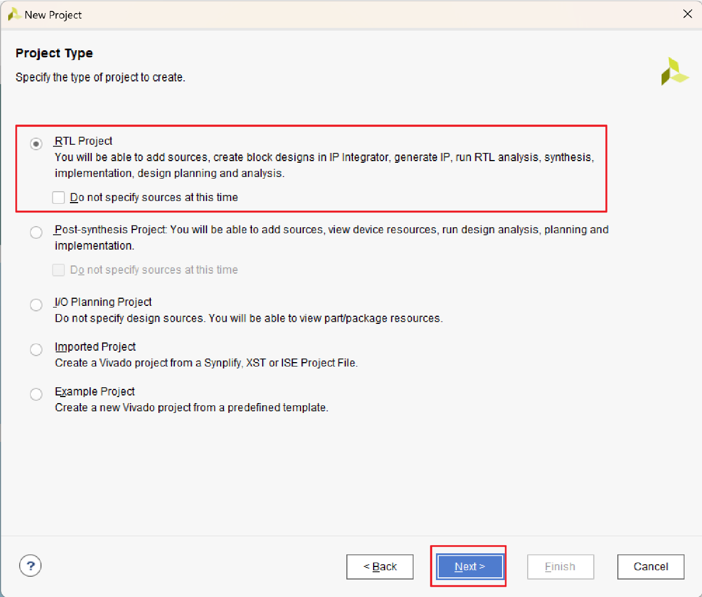

### 4.2 添加设计源

在 `Add Sources` 页面点 `Add Directories`，加入下面三个目录。
勾选 **Scan and add RTL include files into project** 和 **Add sources from subdirectories**，
**不要**勾选 Copy sources into project（否则改源码时要改两份）。

| 目录 | 内容 |
|---|---|
| `SoC_cv32e40p/cpu_cv32e40p` | CV32E40P CPU（包括 `include/` 里的包） |
| `SoC_cv32e40p/soc/rtl` | AXI、debug、存储、SoC 顶层 |
| `SoC_cv32e40p/simple_npu/rtl` | 你的 NPU |

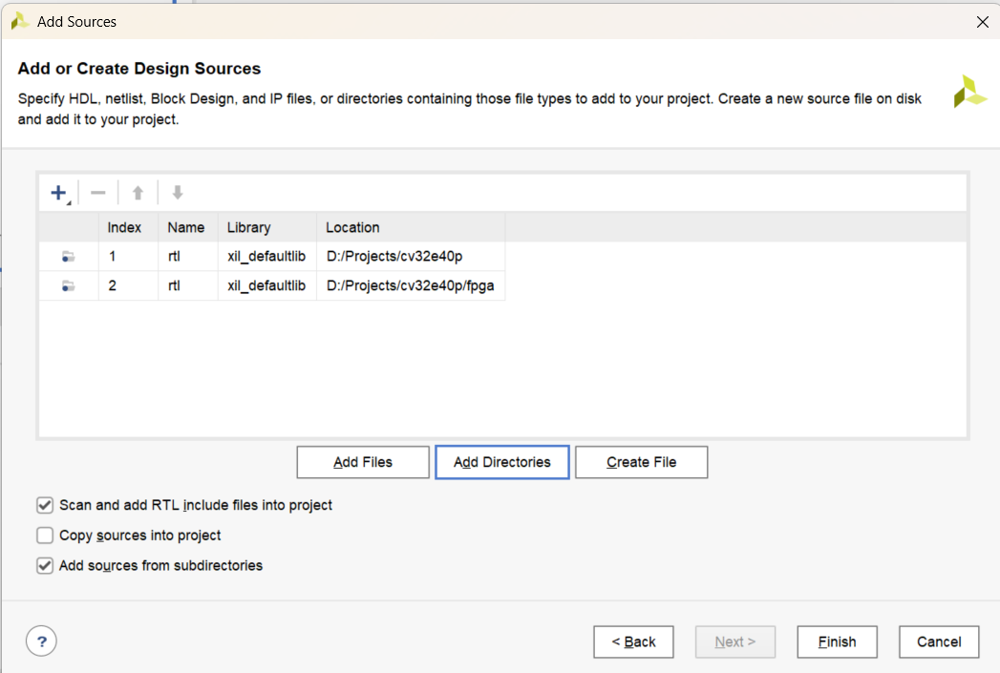

!!! note "关于 `cpu_cv32e40p/vendor/`"
    Lab 2 里说过 `vendor/`（浮点单元等）不需要编译。整个目录加进来也没关系：
    Vivado 会从顶层往下找真正被例化的模块，没用到的文件不会进入综合。

**仿真源**（只在做 §6 仿真时需要）：在同一个向导里切到 `Add or Create Simulation Sources`，
加入 `soc/sim/tb/my_soc_tb.sv`。勾选 **Include all design sources for simulation**。

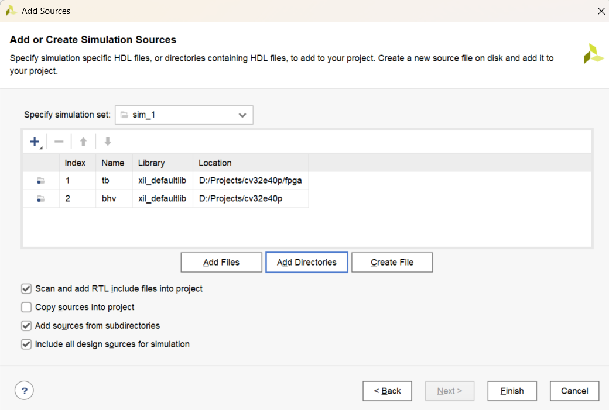

### 4.3 先不加约束，选择器件

`Add Constraints` 这一页先跳过，直接 `Next`。器件选择 **`xc7a35tcsg324-1`**（EGo1 上的 FPGA）。

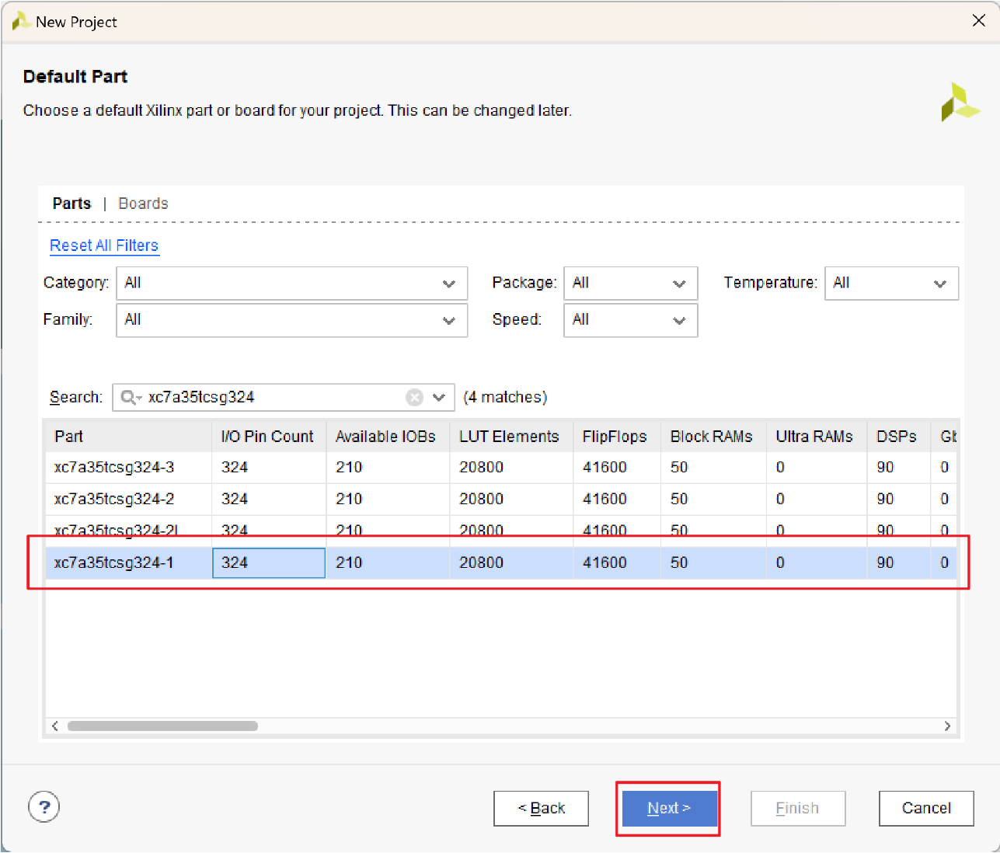

### 4.4 头文件路径

AXI 相关的文件里有 `` `include "axi/typedef.svh" ``，需要告诉 Vivado 去哪里找头文件。
`Settings` → `General` → `Verilog options` → `Verilog Include Files Search Paths`，加入：

```
<你的路径>/SoC_cv32e40p/soc/rtl/include
```

如果第 4.2 步勾选了 Scan and add RTL include files，Vivado 一般已经能找到，但显式加上更稳妥。

## 5. FPGA 顶层

### 5.1 生成 Clocking Wizard

`PROJECT MANAGER` → `IP Catalog`，搜索 `clocking`，双击 **Clocking Wizard**。只需要改下面几项，
其余保持默认：

| 位置 | 设置 |
|---|---|
| Component Name | `clk_wiz_0`（默认值，和下面的代码对应） |
| Clocking Options → Input Clock Information | Primary 输入频率 **100 MHz** |
| Output Clocks → clk_out1 | Requested **50 MHz** |
| Output Clocks → 底部 Enable Optional Inputs / Outputs | **取消 `reset`**，**保留 `locked`** |

点 `OK` → `Generate`。生成后它就是一个可以直接例化的模块 `clk_wiz_0`，
端口为 `clk_in1`、`clk_out1`、`locked`。

!!! tip "为什么不用计数器二分频"
    用一个触发器翻转也能得到 50 MHz，但那样产生的时钟走的是普通布线，延迟和抖动都不可控。
    Clocking Wizard 用的是 FPGA 内部专门的时钟管理单元（MMCM），输出直接上全局时钟网络，
    Vivado 也能自动推导出它的时序约束（§7.2）。

### 5.2 `fpga_top.sv`

在 `SoC_cv32e40p/` 下新建 `fpga/fpga_top.sv`，内容如下，然后把它加入工程
（`Add Sources` → `Add or create design sources` → `Add Files`）：

```systemverilog
`timescale 1ns/1ps

// Lab 6 · FPGA 顶层
//   板载 100 MHz 时钟 --Clocking Wizard--> 50 MHz 系统时钟
//   时钟稳定（locked）之后才释放复位：异步置位、同步释放
module fpga_top (
    input  logic fpga_clk_i,   // 板载 100 MHz 时钟
    input  logic rst_ni,       // 复位按键，低有效
    input  logic tck_i,        // JTAG
    input  logic tms_i,
    input  logic td_i,
    output logic td_o
    // TODO：在这里加上你的 LED 输出端口
);

  // ---------------- 时钟：100 MHz -> 50 MHz ----------------
  logic clk_sys;      // 50 MHz，给整个 SoC 用
  logic clk_locked;   // 1 = 时钟已稳定

  clk_wiz_0 u_clk_wiz (
      .clk_in1  (fpga_clk_i),
      .clk_out1 (clk_sys),
      .locked   (clk_locked)
  );

  // ---------------- 复位：等时钟稳定后再释放 ----------------
  // 按下复位键或时钟还没稳定，都立刻复位
  wire async_rst_n = rst_ni & clk_locked;

  // 两级寄存器：复位来时立刻生效，撤销时跟着 clk_sys 打两拍再放开
  logic [1:0] rst_sync_q;
  always_ff @(posedge clk_sys or negedge async_rst_n) begin
    if (!async_rst_n) rst_sync_q <= 2'b00;
    else              rst_sync_q <= {rst_sync_q[0], 1'b1};
  end

  logic rst_sys_n;
  assign rst_sys_n = rst_sync_q[1];

  // ---------------- 你在 Lab 3 完成的 SoC ----------------
  my_soc_top u_soc (
      .clk_i  (clk_sys),
      .rst_ni (rst_sys_n),
      .tck_i  (tck_i),
      .tms_i  (tms_i),
      .td_i   (td_i),
      .td_o   (td_o)
  );

  // TODO：在这里加上 LED 指示逻辑

endmodule
```

然后把它设为**综合顶层**：`Settings` → `General` → `Top module name` 填 `fpga_top`
（或者在 Sources 窗口里右键 `fpga_top` → `Set as Top`）。

!!! note "为什么要「同步释放」"
    复位信号撤销的那一刻如果正好落在时钟沿附近，不同的触发器可能一个看到复位、一个没看到，
    整个系统从一个不一致的状态开始运行。两级寄存器让复位的"撤销"对齐到 `clk_sys` 的时钟沿上，
    这是 FPGA 和芯片设计里的标准做法。

### 5.3 加几个 LED 指示上板状态

上板之后看不到波形，最直接的判断手段就是 LED。建议你在 `fpga_top` 里自己加上几个，
这对后面排查问题非常有帮助（下面只给思路，代码自己写）：

| LED | 含义 | 实现思路 |
|---|---|---|
| locked 灯 | Clocking Wizard 是否锁定 | 直接 `assign` 成 `clk_locked`。**不亮说明时钟没起来，后面全都不用看** |
| 心跳灯 | 系统时钟和复位是否正常 | 在 `clk_sys` 下用计数器分频到 1 Hz 左右翻转。用 `rst_sys_n` 复位，按住复位键时应停止闪烁 |
| tck 灯 | JTAG 时钟是否进来了 | 在 `tck_i` 下计数，计到一定值就翻转。OpenOCD 连接时会有一阵 tck，灯应该会变化 |

LED 的管脚见 §7.1。EGo1 的 LED 是高电平点亮。

## 6. 在 Vivado 中调用 ModelSim 仿真

!!! note "可选"
    **如果你已经在 Lab 3 完成仿真，本节为可选部分；如果没有，那么本节必做。**
    这里仿真的仍然是 Lab 3 的 `my_soc_tb`（SoC 本身），只是换成从 Vivado 里启动 ModelSim。
    Vivado 自带的仿真器 XSIM 跑这个 SoC 非常慢，所以改用 ModelSim。

### 6.1 编译仿真库

ModelSim 要仿真 Vivado 的 IP，需要先把 Vivado 的仿真库编译成 ModelSim 能用的格式。
`Tools` → `Compile Simulation Libraries`：

| 选项 | 设置 |
|---|---|
| Simulator | ModelSim Simulator |
| Family | **Artix-7**（只编译这一个系列，否则所有系列都编会非常慢） |
| Compiled library location | 建议在 ModelSim 的**安装目录下新建一个文件夹**，例如 `D:/modeltech64_2019.2/vivado_artix7_lib` |
| Simulator executable path | ModelSim 的 `win64` 目录，例如 `D:/modeltech64_2019.2/win64` |

点 `Compile`，大约需要 20 分钟，期间可以先往下做 §7。

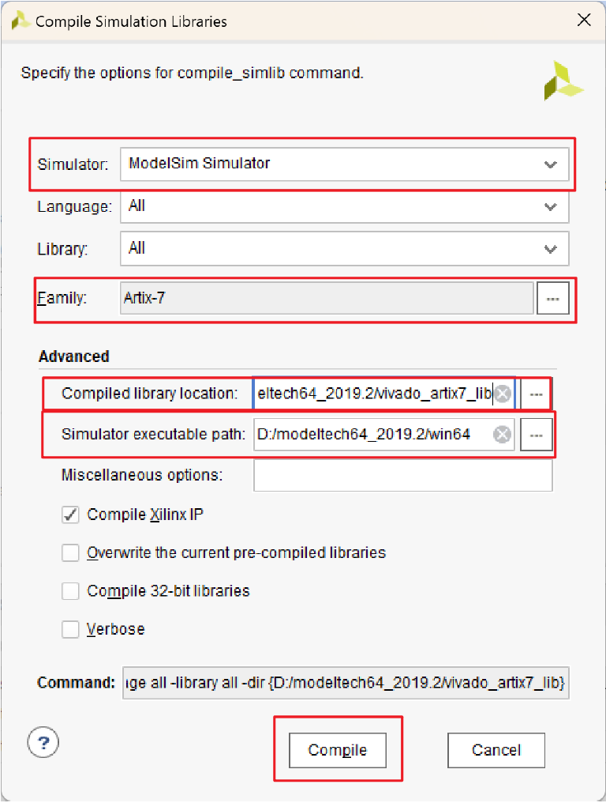

### 6.2 仿真设置

`Settings` → `Simulation`：

| 选项 | 设置 |
|---|---|
| Target simulator | ModelSim Simulator |
| Simulation top module name | **`my_soc_tb`**（Lab 3 的 testbench） |
| Compiled library location | §6.1 里填的那个文件夹 |
| `Simulation` 页签 → `modelsim.simulate.log_all_signals` | **勾上**。这样仿真时会记录所有信号的波形，跑完再加信号也有数据（同 Lab 2 §5.2 的 `log -r /*`） |
| `Simulation` 页签 → `modelsim.simulate.vsim.more_options` | `-suppress 12110 -novopt`（同 Lab 2 §5.4） |
| `Compilation` 页签 | 和 §4.4 一样，也要加上头文件路径 `soc/rtl/include` |

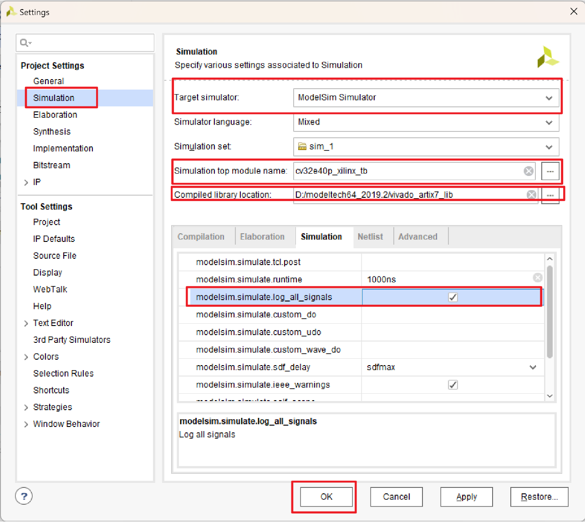

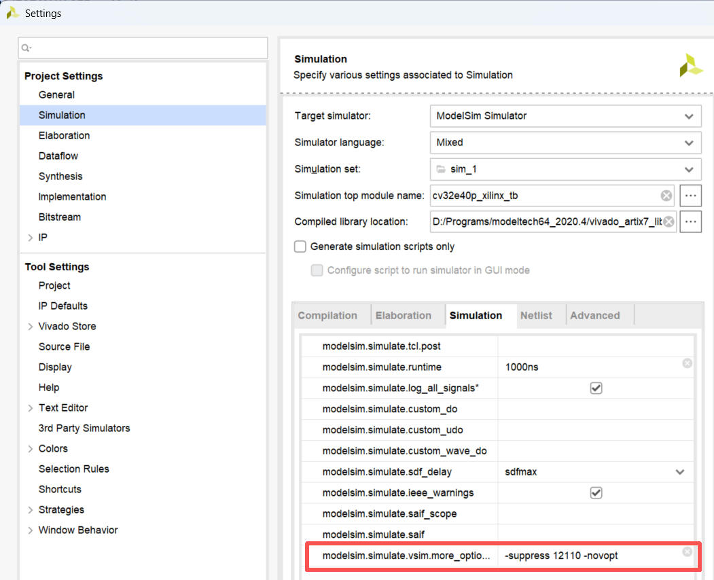

### 6.3 运行

`SIMULATION` → `Run Simulation` → `Run Behavioral Simulation`，Vivado 会自动拉起 ModelSim。
在 ModelSim 的 Transcript 里 `run -all`，应当看到和 Lab 3 一样的 `PASS`。

## 7. 约束、综合、实现、生成比特流

### 7.1 管脚约束

`RTL ANALYSIS` → `Open Elaborated Design`，打开后菜单 `Window` → `I/O Ports`。
左侧列出了 `fpga_top` 的所有端口，在 `Package Pin` 一栏填管脚，`I/O Std` 一栏全部选 **LVCMOS33**
（EGo1 上这些 IO 都是 3.3 V 供电）。

!!! warning "以下管脚为参考，请自行核对 [EGo1 用户手册](https://e-elements.readthedocs.io/zh/ego1_v2.2/EGo1.html)"

| 端口 | 管脚 | 板上位置 | 手册章节 |
|---|---|---|---|
| `fpga_clk_i` | P17 | 板载 100 MHz 时钟 | 3 系统时钟 |
| `rst_ni` | P15 | RST 按键（S6） | 5.1 按键 |
| `tck_i` | E15 | J5 扩展口 17 脚 | 14 通用扩展 I/O |
| `td_i` | E16 | J5 扩展口 18 脚 | 14 通用扩展 I/O |
| `td_o` | D15 | J5 扩展口 19 脚 | 14 通用扩展 I/O |
| `tms_i` | C15 | J5 扩展口 20 脚 | 14 通用扩展 I/O |
| LED（自选，§5.3） | 例如 K3、M1、K1 | 板上 LED | 5.3 LED 灯 |

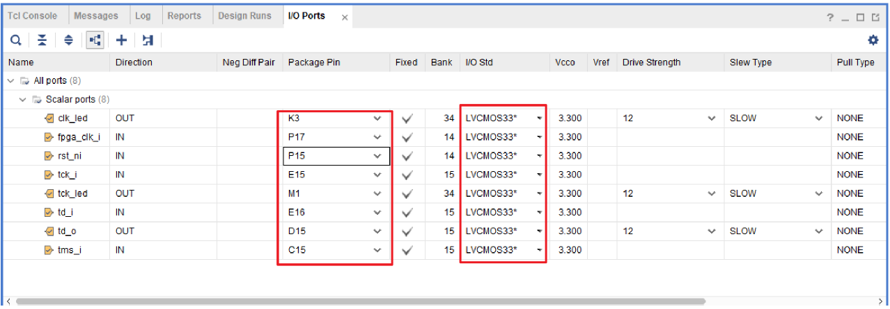

填完后 `Ctrl+S`，Vivado 会提示把约束保存成一个新的 `.xdc` 文件，起个名字（例如 `fpga_top.xdc`）即可。

!!! note "复位按键的电平"
    `rst_ni` 是低有效。有时候工程直接把 P15（专用 RST 按键）当作低有效复位使用。
    但手册只写了五个**通用**按键"默认为低电平，按下时输出高电平"，没有写 RST 按键的电平。如果烧写后心跳灯不闪、按住复位键反而开始闪，
    说明电平是反的，在 `fpga_top` 里把 `rst_ni` 取反后再用。这一点请上板时自己确认。

### 7.2 时序约束

管脚约束保存后，先 `Run Synthesis` 一次（约 5 分钟），然后
`SYNTHESIS` → `Open Synthesized Design` → `Constraints Wizard`。

**Primary Clocks**：Vivado 会识别出两个从管脚输入的时钟，填上频率：

| 时钟 | 频率 | 说明 |
|---|---|---|
| `fpga_clk_i` | 100 MHz | 板载时钟 |
| `tck_i` | 1 MHz 即可 | JTAG 时钟，由下载器给出，不需要高频 |

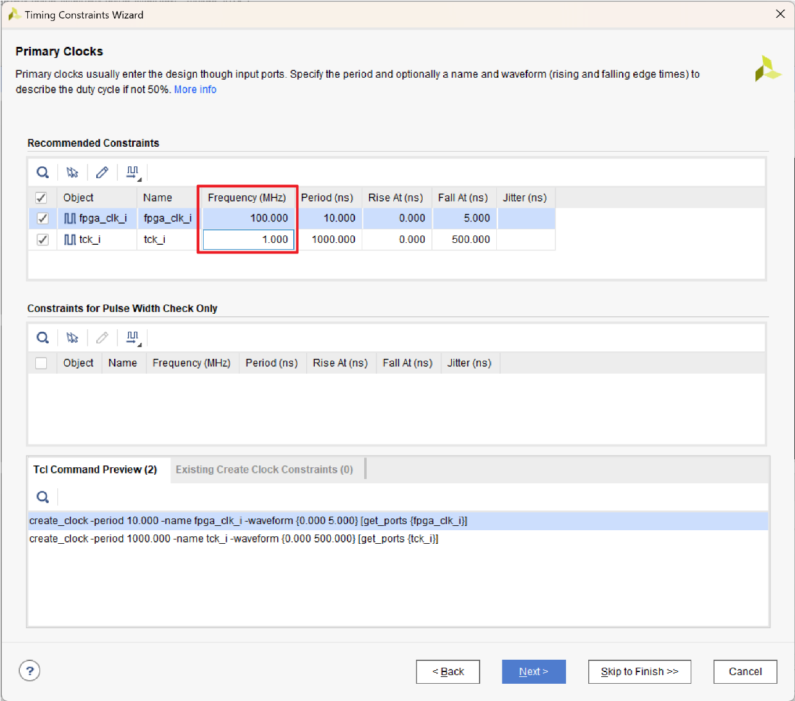

**Generated Clocks**：用了 Clocking Wizard 之后，50 MHz 时钟由 Vivado 根据 IP 自动推导，
**这一页不需要填**（如果项目使用计数器二分频，那么才需要在这里指定 Divide by 2）。

**Asynchronous Clock Groups**：`tck_i` 和 50 MHz 系统时钟互不相关，跨越两者的信号已经在
Debug Module 里用专门的跨时钟域电路处理过（`soc/rtl/debug/dmi_cdc.sv`）。
在这一页把它们设为**异步**，Vivado 就不会再按同步时钟去检查它们之间的路径。

点 `Finish`，约束会写进你的 `.xdc`。最终 `.xdc` 里的时序部分大致是这样：

```tcl
create_clock -period 10.000 -name fpga_clk_i -waveform {0.000 5.000} [get_ports fpga_clk_i]
create_clock -period 1000.000 -name tck_i -waveform {0.000 500.000} [get_ports tck_i]
set_clock_groups -asynchronous -group [get_clocks tck_i] -group [get_clocks -include_generated_clocks fpga_clk_i]
```

!!! tip "不想点向导，也可以直接写"
    上面三行直接粘贴进 `.xdc` 效果一样。最后一行如果漏了，综合后的 methodology 报告会多出
    `TIMING-6 / TIMING-7` 两条 Critical Warning（时钟之间没有公共源却被一起检查）和一串
    `Large hold violation` 警告。

### 7.3 综合、实现、生成比特流

依次点：

1. `Run Synthesis`（加完时序约束后**再综合一次**）
2. 综合完成对话框里选 `Run Implementation`
3. 实现完成对话框里选 `Generate Bitstream`

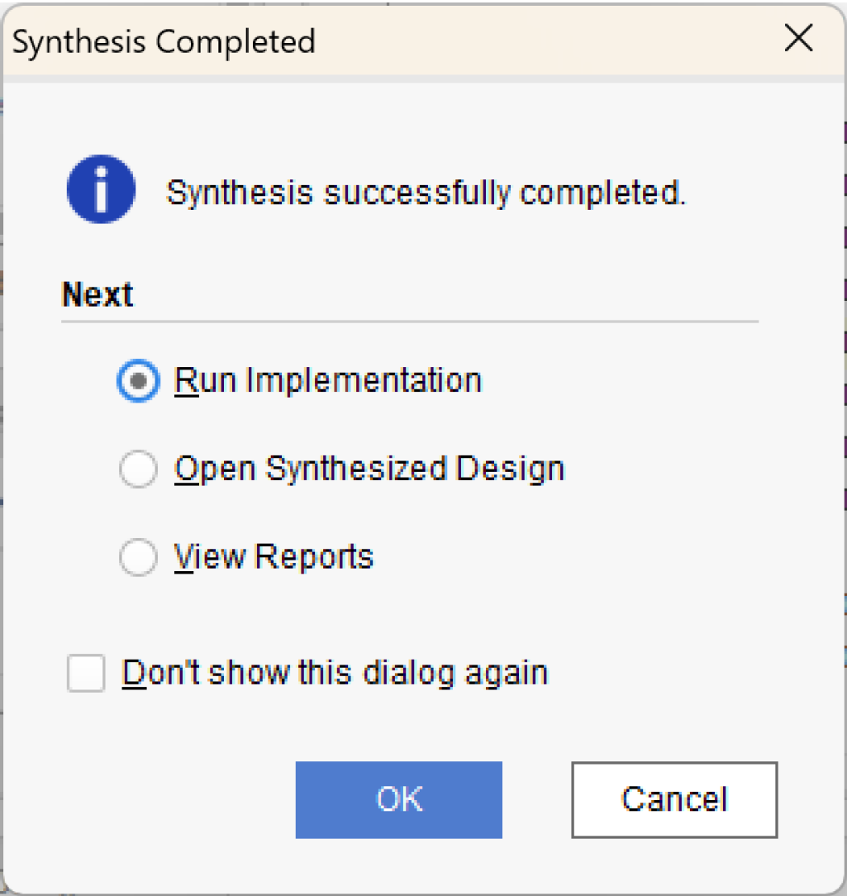

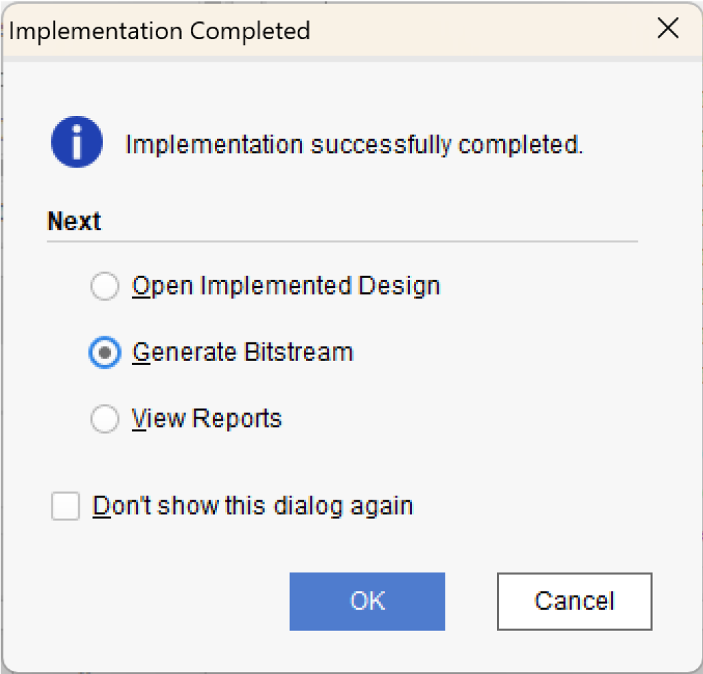

整个流程大约 10~15 分钟（视电脑性能而定）。

### 7.4 看报告：确认这块比特流"真的对"

生成比特流不代表设计是对的。在烧写之前，检查下面三项：

**(1) 程序有没有装进主存**：打开综合日志（`Reports` → `Synthesis` → `Vivado Synthesis Report`，
或 `<工程>.runs/synth_1/runme.log`），搜索 `readmem`：

| 看到 | 说明 |
|---|---|
| `INFO: [Synth 8-3876] $readmem data file '...lab3_test1.hex' is read successfully` | 正确 |
| `CRITICAL WARNING: [Synth 8-4445] could not open $readmem data file ...` | **没读到**，主存是空的，回 §2.3 |

**(2) 主存是不是变成了 BRAM**：`Report Utilization`，看 `Memory` 一节的 `Block RAM Tile`。
Lab 3 的主存是 2048 × 32 bit = 8 KB，应当用掉 **2 个 RAMB36**。

!!! tip "关于 BRAM"
    `sram_ff.sv` 是按"同步读、字节使能写、单端口"的标准写法写的（Lab 2 Task 4），
    这种写法 Vivado 能**自动识别并综合成 BRAM**，同时把 `$readmemh` 读到的内容作为 BRAM 的初始值
    写进比特流，所以不需要手动生成 Block Memory Generator IP。
    如果你看到的不是 BRAM，而是用掉了大量 LUT 或者寄存器，说明你的 `sram_ff` 写法不规范
    （例如写成了组合读、或者读写分在了两个 always 块里），回去对照 Lab 2 §4.4 的三条契约。

**(3) 时序是否满足**：`Report Timing Summary`，看 **WNS（Worst Negative Slack）**。
WNS ≥ 0 才表示所有路径都能在 50 MHz 下按时完成。

下面是一组参考数据（Lab 3 脉动阵列 SoC + 本讲义的 `fpga_top`，Vivado 2023.1）：

| 项目 | 结果 |
|---|---|
| LUT | 约 8.7 k / 20.8 k（42%） |
| 寄存器 | 约 6.0 k / 41.6 k（14%） |
| Block RAM Tile | 2 / 50 |
| DSP | 5 / 90 |
| MMCM | 1 / 5（Clocking Wizard） |
| WNS @ 50 MHz | 约 +1.4 ~ +2.1 ns（每次运行略有不同） |

你的数字和这里有出入是正常的（NPU 实现不同），只要 WNS ≥ 0 就可以继续。
如果 WNS 是负的，先确认 Clocking Wizard 输出的确实是 50 MHz，而不是 100 MHz。

## 8. 烧写与接线

### 8.1 烧写比特流

用 Type-C 线把 EGo1 接到电脑（这根线同时负责供电和烧写），打开电源开关。
`PROGRAM AND DEBUG` → `Open Hardware Manager` → `Open Target` → `Auto Connect`，
识别到 `xc7a35t` 后右键 → `Program Device`，选择 `<工程>.runs/impl_1/fpga_top.bit`。

烧写成功后先看 LED（§5.3）：

| 现象 | 说明 |
|---|---|
| locked 灯亮、心跳灯闪烁 | 时钟和复位都正常，CPU 已经开始运行 |
| locked 灯不亮 | Clocking Wizard 没锁定，检查 `fpga_clk_i` 的管脚 |
| locked 灯亮、心跳灯不闪 | 一直处于复位状态，检查复位按键的管脚和电平（§7.1） |

!!! note "Type-C 线和 JTAG 下载器是两回事"
    EGo1 板载的 Type-C 口内部也是一个 JTAG，接的是 **FPGA 本身**，Vivado 用它来烧写比特流。
    下一步要接的 USB-JTAG 下载器连的是**你的 SoC 里的 Debug Module**，用来调试 CPU。
    两条 JTAG 链互不相干，两根线要同时插着。

### 8.2 JTAG 接线

我们用的 USB-JTAG 下载器（核心芯片是 FTDI FT232H）：


下载器一端的 2×5 插座定义如下：

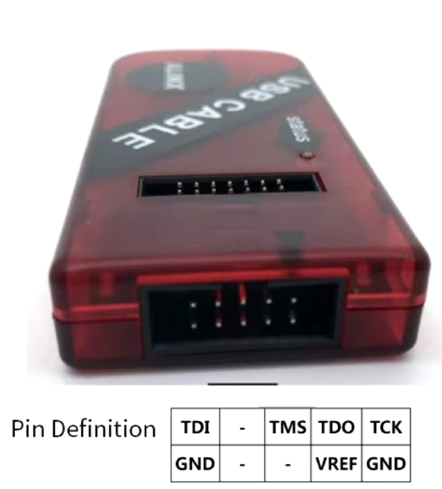

EGo1 的 J5 扩展口（2×18 针）原理图：

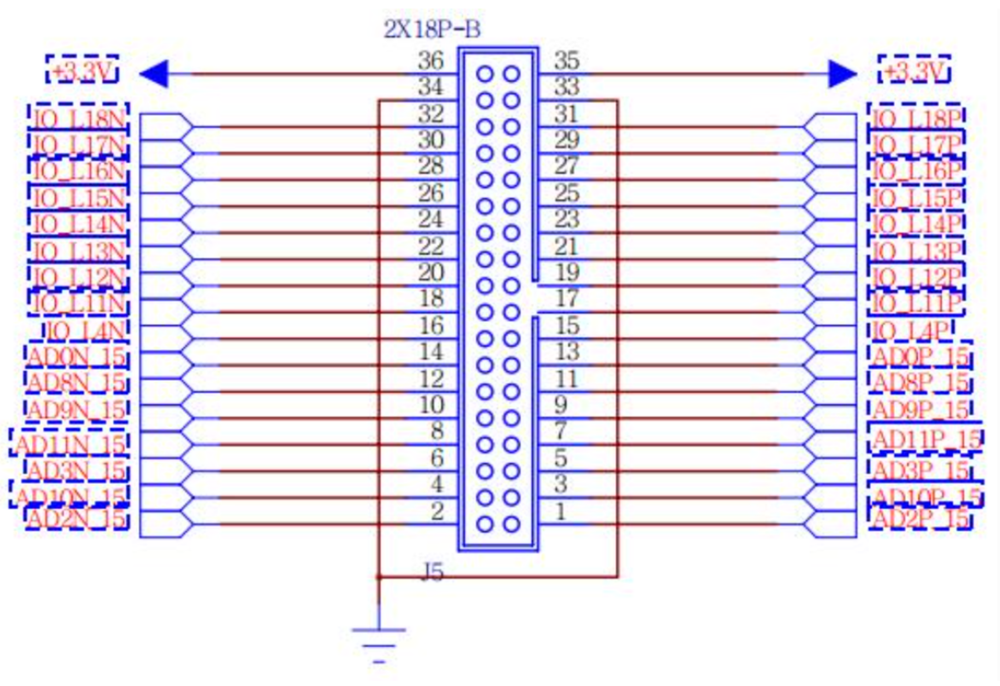

用杜邦线**按下表把 6 根线全部接上**：

!!! warning "以下接线为参考，请自行核对 [EGo1 用户手册](https://e-elements.readthedocs.io/zh/ego1_v2.2/EGo1.html) 第 14 节和 §7.1 的管脚约束"

| 下载器引脚 | 接到 J5 的脚号 | FPGA 管脚 | SoC 端口 |
|---|---|---|---|
| TCK | 17 | E15 | `tck_i` |
| TDI | 18 | E16 | `td_i` |
| TDO | 19 | D15 | `td_o` |
| TMS | 20 | C15 | `tms_i` |
| VREF | 35 或 36（+3.3V） | — | — |
| GND | 33 或 34（GND） | — | — |

!!! note "VREF 和 GND 为什么也要接"
    - **GND**：两块板子的"0 电平"必须是同一个参考，否则信号电平没有意义。必须接
    - **VREF**：下载器用它来判断目标板的 IO 电压，并据此决定输出信号的电平。
      我们的 JTAG 管脚都约束成了 LVCMOS33，所以 VREF 接 J5 上的 3.3V。
      VREF 只是一个参考输入，不会给板子供电
    - 下载器上有两个 GND 脚，接一个就够，两个都接更稳

注意 TDI / TDO 的方向：下载器的 **TDI** 是它**发出**的数据，接到 SoC 的输入 `td_i`；
SoC 的输出 `td_o` 接回下载器的 **TDO**。

接好后，所有硬件连接就完成了。

## 9. 用 OpenOCD + GDB 调试 CPU

### 9.1 RISC-V 调试体系

为了便于调试，RISC-V 规定了 Debug Module 的设计规范，以便调试器与 CPU 之间通信，
详见 [RISC-V Debug Specification](https://riscv.org/wp-content/uploads/2024/12/riscv-debug-release.pdf)。

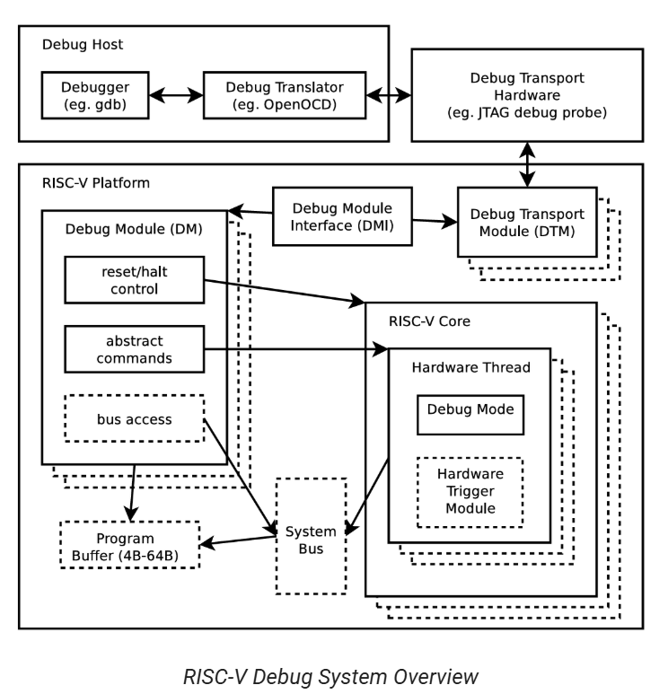

从上往下：

- 与我们直接交互的**软件**是**调试器（Debugger）**，本实验用 RISC-V GDB，运行在电脑上
- 调试器与**调试转换器（Debug Translator）**通信，本实验用 OpenOCD
- 调试转换器驱动**调试传输硬件（Debug Transport Hardware）**，也就是 USB-JTAG 下载器
- 下载器通过 JTAG 信号连到 SoC 里的**调试传输模块（DTM）**，对应 Lab 3 SoC 里的 `dmi_jtag`
- DTM 通过 **DMI** 访问**调试模块（DM）**，对应 `dm_top`。DM 能让 CPU 停下（halt）、
  读写寄存器，还能作为一个 AXI master 直接读写总线上的任何地址——
  这正是 Lab 2 图里 debug module 既是 master 又是 slave 的原因

### 9.2 在 WSL 中安装 OpenOCD

WSL 可能自带一个 OpenOCD，版本太旧不支持 RISC-V，先卸载：

```bash
sudo apt-get remove openocd
```

下载 RISC-V 版 OpenOCD 源码并编译安装：

```bash
git clone https://github.com/riscv/riscv-openocd
cd riscv-openocd
sudo apt-get install libftdi-dev libusb-1.0-0 libusb-1.0-0-dev autoconf automake texinfo pkg-config libjim-dev
./bootstrap
./configure --enable-ftdi
make -j$(nproc)
sudo make install
```

验证：

```bash
which openocd
openocd -v
```

应当输出 `/usr/local/bin/openocd` 和类似 `Open On-Chip Debugger 0.12.0+dev-...` 的版本信息。

### 9.3 把 USB 下载器映射进 WSL

WSL 自带 FTDI 驱动，不需要额外安装。但 WSL 默认看不到 Windows 上的 USB 设备，
需要用 [usbipd-win](https://github.com/dorssel/usbipd-win/releases) 把它"借"给 WSL。
**请安装 4.0.0 及以上版本**。

在**管理员权限**的 PowerShell 中，先找到下载器：

```powershell
usbipd list
```

```
Connected:
BUSID  VID:PID    DEVICE                        STATE
1-4    048d:c101  USB 输入设备                   Not shared
2-4    0bda:4852  Realtek Bluetooth Adapter     Not shared
4-3    0403:6014  USB Serial Converter          Not shared
```


找到 `VID:PID` 为 `0403:6014` 的那一行，记下它的 `BUSID`（上例是 `4-3`，你的可能不同），然后：

```powershell
usbipd bind --busid 4-3
usbipd attach --wsl --busid 4-3
```

`bind` 只需要做一次；`attach` 在每次重新插拔下载器、或重启电脑后都要再做一次。
回到 WSL 中确认：

```bash
lsusb
```

能看到 `ID 0403:6014 Future Technology Devices International, Ltd FT232H ...` 即映射成功。

### 9.4 配置文件与启动 OpenOCD

OpenOCD 通过配置文件（`.cfg`）知道"用的是什么下载器、目标是什么 CPU"。
在 WSL 中新建 `cv32e40p.cfg`：

```tcl
adapter speed     10

adapter driver ftdi
transport select jtag
ftdi vid_pid 0x0403 0x6014

# Channel 1 is taken by Xilinx JTAG
ftdi channel 0

ftdi layout_init 0x0018 0x001b
ftdi layout_signal nTRST -ndata 0x0010

set _CHIPNAME riscv
jtag newtap $_CHIPNAME cpu -irlen 5

set _TARGETNAME $_CHIPNAME.cpu
target create $_TARGETNAME riscv -chain-position $_TARGETNAME -coreid 0

gdb report_data_abort enable
gdb report_register_access_error enable

riscv set_command_timeout_sec 120
riscv set_mem_access progbuf sysbus abstract

init
halt
echo "Ready for Remote Connections"
```

几个关键行：

| 配置 | 含义 |
|---|---|
| `adapter speed 10` | JTAG 时钟 10 kHz。杜邦线连接质量一般，速度低一点更稳 |
| `ftdi vid_pid 0x0403 0x6014` | 下载器的 VID:PID，和 §9.3 里看到的一致 |
| `jtag newtap ... -irlen 5` | SoC 里 `dmi_jtag_tap` 的指令寄存器长度是 5 位 |
| `riscv set_mem_access progbuf sysbus abstract` | 访问内存的方式优先级：先让 CPU 执行指令去读写，不行再让 DM 直接走总线 |
| `init` / `halt` | 连上之后立刻让 CPU 停下 |

!!! note "网上找到的旧配置文件"
    网上的一些教程里会写 `gdb_report_data_abort enable` 和 `riscv set_reset_timeout_sec 120`。
    在新版 OpenOCD 中，前者已改为 `gdb report_data_abort enable`（中间是空格），
    后者已被删除，写了会直接报错退出。以上面这份为准。

启动：

```bash
sudo openocd -f cv32e40p.cfg
```

连接成功时输出类似下面这样（**仅为示例**：版本号、`XLEN`、`misa` 等以实际输出为准；
我们的 cv32e40p 是 32 位的，`XLEN` 应为 32）：

```
Open On-Chip Debugger 0.12.0+dev-03598-g78a719fad (2024-01-20-05:43)
Info : clock speed 10 kHz
Info : JTAG tap: riscv.cpu tap/device found: 0x00000001 (mfg: 0x000 (<invalid>), part: 0x0000, ver: 0x0)
Info : [riscv.cpu] datacount=2 progbufsize=8
Info : [riscv.cpu] Examined RISC-V core
Info : [riscv.cpu] XLEN=64, misa=0x800000000014112d
[riscv.cpu] Target successfully examined.
Info : starting gdb server for riscv.cpu on 3333
Info : Listening on port 3333 for gdb connections
Ready for Remote Connections
Info : Listening on port 6666 for tcl connections
Info : Listening on port 4444 for telnet connections
```

最关键的是 `JTAG tap: riscv.cpu tap/device found` 和 `Listening on port 3333`。
**保持这个终端开着**，OpenOCD 要一直运行。

### 9.5 安装 RISC-V 工具链（GDB）

在 WSL 中下载 [riscv-none-elf-gcc 工具链](https://github.com/xpack-dev-tools/riscv-none-elf-gcc-xpack/releases/download/v13.2.0-2/xpack-riscv-none-elf-gcc-13.2.0-2-linux-x64.tar.gz)
并解压，例如解压到 `/opt/riscv`。然后把它的 `bin` 目录加入 `PATH`，
在 `~/.bashrc` 末尾加上两行：

```bash
# RISC-V toolchain
export RISCV=/opt/riscv
export PATH="$RISCV/bin:$PATH"
```

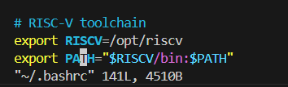

执行 `source ~/.bashrc` 或者重新打开终端，然后验证：

```bash
riscv-none-elf-gdb --version
```

!!! note "解压后的目录结构"
    xpack 的压缩包解压出来是 `xpack-riscv-none-elf-gcc-13.2.0-2/`，里面才是 `bin/`。
    `RISCV` 要指向含有 `bin/` 的那一层。

### 9.6 用 GDB 连接 OpenOCD

**另开一个** WSL 终端：

```bash
riscv-none-elf-gdb
```

进入 `(gdb)` 提示符后：

```
(gdb) target remote :3333
```

连接成功后 GDB 会显示 CPU 当前停在哪个地址。

## 10. 上板体验

到这里，你已经能通过 GDB 控制板子上的 CPU 了。本节不设验收，下面几件事建议都试一试。

### 10.1 常用 GDB 命令

| 命令 | 作用 |
|---|---|
| `info registers` | 列出所有通用寄存器和 PC |
| `p $t0` / `p/x $t0` | 查看某个寄存器（`/x` 以十六进制显示） |
| `x/10xw 0x80000000` | 以字（4 字节）为单位，十六进制显示从该地址开始的 10 个字 |
| `x/10xb`、`x/10xh` | 同上，以字节 / 半字为单位 |
| `x/5i $pc` | 把内存内容当成**指令**反汇编，显示 PC 处开始的 5 条 |
| `set {int}0x80001000 = 0x1234` | 向该地址写入 4 字节 |
| `set $t0 = 5`、`set $pc = 0x80000000` | 写寄存器 / 改 PC |
| `break *0x80000024` | 在该地址设断点 |
| `info break`、`disable 1` | 查看断点 / 禁用 1 号断点 |
| `stepi` | 单步执行一条指令 |
| `c` | 继续运行，直到断点或手动按 `Ctrl+C` 停下 |

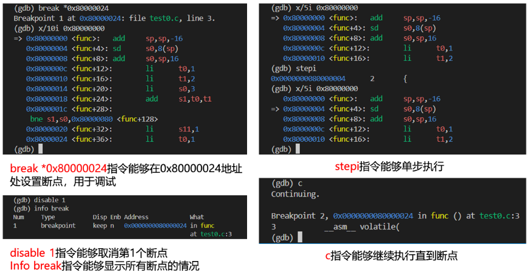

### 10.2 确认测试程序在板子上跑完了

比特流里的主存初始内容就是 `lab3_test1.hex`（§7.4），所以烧写、复位释放之后 CPU 已经把
Lab 3 的 test1 跑完了。程序把结果写在主存顶端的 magic 区域（Lab 3 §3.7），用 GDB 读出来：

```
(gdb) x/6xw 0x80001FE0
```

第一个字应当是 **`0xc0dec0de`**（PASS）。在 ModelSim 里是 testbench 替你看这个地址，
在板子上就是你通过 JTAG 亲自去看。

再看看 CPU 现在停在哪里：

```
(gdb) x/3i $pc
```

test1 的 `main` 返回后会进入 `startup.S` 里的 `loop: j loop` 死循环，
PC 应停在 `0x8000002e`（在 Lab 3 的 `soc/sim/sw/lab3_test1.dump` 里搜 `<loop>` 可以对上）。

### 10.3 在板子上直接访问你的 NPU

GDB 读写内存走的也是总线，所以它可以像 CPU 一样访问 `0x7000_0000` 开始的 MMIO 地址。
这相当于把 Lab 3 Task 5 的手写汇编，换成在 GDB 里一条一条手动执行。

test1 跑完后 ACT / WGT 里还留着它的数据。为了让结果好算，先把 A 的第 0 行、B 的第 0 列清零
（列优先打包：`A[0][k]` 在 `ACT[k*4]`，`B[k][0]` 在 `WGT[k]`），再写入 `A[0][0] = 3`、`B[0][0] = 5`：

```
set {int}0x70000050 = 0
set {int}0x70000060 = 0
set {int}0x70000070 = 0
set {int}0x70001004 = 0
set {int}0x70001008 = 0
set {int}0x7000100c = 0
set {int}0x70000040 = 3
set {int}0x70001000 = 5
x/1xw 0x70000040
set {int}0x70000000 = 1
x/1xw 0x70000004
x/1dw 0x70002000
```

| 命令 | 含义 | 预期 |
|---|---|---|
| 前 6 条 | `A[0][1..3] = 0`、`B[1..3][0] = 0` | |
| `set {int}0x70000040 = 3` | `ACT[0] = A[0][0] = 3` | |
| `set {int}0x70001000 = 5` | `WGT[0] = B[0][0] = 5` | |
| `x/1xw 0x70000040` | 读回 `ACT[0]` | `0x00000003` |
| `set {int}0x70000000 = 1` | 写 `CONTROL`，启动计算 | |
| `x/1xw 0x70000004` | 读 `STATUS` | `0x00000001`（DONE） |
| `x/1dw 0x70002000` | 读 `OUT[0] = C[0][0]` | `15` |

!!! note "GDB 命令行里不能写注释"
    GDB 会把 `#` 当成表达式的一部分并报 `Invalid character '#'`，所以上面的命令没有行尾注释。

可以继续试试：

- 读 `0x70002000` ~ `0x7000203C` 把 16 个结果全部读出来，和你手算的对一对
- 读一个没有映射的地址，例如 `x/1xw 0x60000000`，看看是不是 Lab 3 里见过的那个值
- 在 `main` 里写 NPU 的那条 `sw` 指令处打断点（地址从 `.dump` 里找），
  再用 `set $pc = 0x80000000` 让程序从头开始、`c` 继续运行，停下后用 `p $a2`、`p/x $a5`
  看它要往哪个地址写什么。（不要用板上的复位键：它同时会复位 Debug Module 和 JTAG 接口，OpenOCD 的连接会出错，需要重启 OpenOCD）

!!! danger "写入 ROM 区域"
    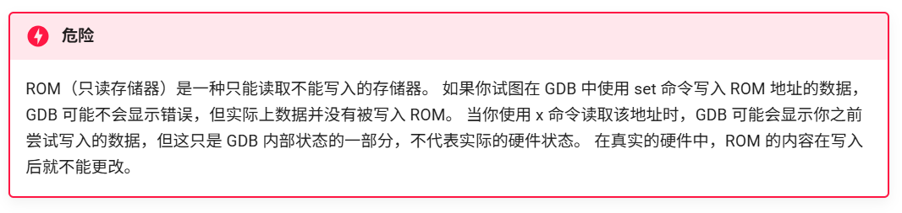

    本 SoC 里 `0x0001_0000` 开始的是 bootram，看名字像 ROM，但它其实可以写（打开
    `soc/rtl/mem/bootram.sv` 看看 `wen_i` 那一段）。真正的芯片里这类启动存储往往是只读的。
    这段内容是复位后执行的第一段代码，**不要随手改**。好在本 SoC 的 bootram 每次复位都会重新装入
    引导指令（Lab 2 Task 2），改坏了按一下复位键就能恢复。

## 11. 常见问题

### Q1 烧写后 LED 完全没反应

先确认 locked 灯（§5.3）。不亮：Clocking Wizard 没锁定，查 `fpga_clk_i` 是不是约束到 P17。
亮但心跳灯不闪：一直在复位，查复位按键的管脚和电平（§7.1）。

### Q2 OpenOCD 报 `unable to open ftdi device`

WSL 里看不到下载器。用 `lsusb` 确认有没有 `0403:6014`；没有就回 §9.3 重新 `usbipd attach`
（每次重新插拔下载器都要重做）。也可能是没有加 `sudo`。

### Q3 OpenOCD 报 `JTAG scan chain interrogation failed: all ones / all zeroes` 或 `Unsupported DTM version`

下载器找到了，但 JTAG 链不通。按顺序查：

1. 板子上电了吗？比特流烧进去了吗？（重新上电后比特流会丢失，要重新烧）
2. 6 根线是否都接好，尤其是 **GND** 和 **VREF**
3. TDI / TDO 是否接反（§8.2 末尾）
4. 管脚约束是否和实际接的 J5 脚号一致
5. 试着把配置文件里的 `adapter speed` 再调低

### Q4 读 `0x80001FE0` 得到的不是 `0xc0dec0de`

- 全是 0：主存可能是空的，查综合日志里的 `readmem`（§7.4）
- `0x12345678`：程序开始了但没跑完。先确认这个 SoC 在 ModelSim 里是 PASS 的；
  再确认 WNS ≥ 0（§7.4）
- 其他值：用 `x/5i $pc` 看 CPU 停在哪里

### Q5 Vivado 综合报 `could not open $readmem data file`

见 §2.3，`INIT_FILE` 要改成绝对路径，分隔符用 `/`。

### Q6 时序不满足（WNS < 0）

确认 Clocking Wizard 的输出是 50 MHz、`fpga_top` 里 SoC 用的是 `clk_sys` 而不是 `fpga_clk_i`。

### Q7 Vivado 或 ModelSim 报一些莫名其妙的文件错误

检查工程路径和源码路径里有没有中文或空格。
